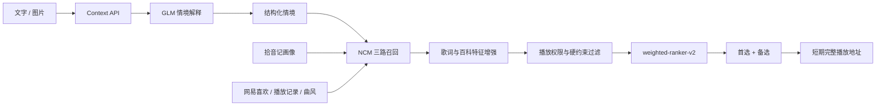

# 拾音记 Demo V1：项目快速接手

> 更新时间：2026-08-14。本文用于让新的开发会话在几分钟内恢复项目上下文并直接开始工作。

## 1. 产品一句话

拾音记是一个情境音乐推荐 Web MVP：用户输入文字、图片或图文，系统先把当下场景解释成结构化情境，再结合账号级音乐画像召回、过滤和重排真实可播放歌曲，默认播放最高分歌曲并提供备选。

长期形态是带摄像头和屏幕表情的智能音箱；当前只验证 Web 端的“情境理解是否能带来更合适的音乐推荐”。

## 2. 当前技术状态

- 前端：React 19、TypeScript、vinext、lucide-react。
- 服务端：App Router API、Cloudflare Worker 兼容运行时。
- 数据：Drizzle ORM + D1/本地 SQLite，画像按拾音记账号保存。
- 语义模型：文本 `glm-4.7-flash`，图片/图文 `glm-4.6v-flash`。
- 音乐服务：本地 NCM Enhanced API，仅用于封闭开发验证。
- 推荐器：`weighted-ranker-v2`，先召回和硬约束过滤，再结合情境与账号画像二次排序。

32 条真实情境评测当前总分为 `0.944`，覆盖旅行、学习、工作和情绪陪伴。高风险情绪不会进入音乐推荐或自动播放。

## 3. 本地启动

要求 Node.js `>=22.13.0`。先启动 NCM Enhanced API：

```powershell
cd D:\Desk\拾音记\ncm-api-enhanced-main
npm start
```

确认音乐服务位于 `http://localhost:4000`，再启动 Web：

```powershell
cd D:\Desk\拾音记\demo-v1
npm install
npm run dev -- --port 3101
```

浏览器打开 `http://localhost:3101`。

## 4. 本地配置与秘密

复制 `.dev.vars.example` 为 `.dev.vars`。`.dev.vars` 已被 Git 忽略，禁止提交真实值：

```dotenv
AI_PROVIDER=zhipu
AI_API_KEY=<local-only>
AI_BASE_URL=https://open.bigmodel.cn/api/paas/v4
AI_TEXT_MODEL=glm-4.7-flash
AI_VISION_MODEL=glm-4.6v-flash

MUSIC_PROVIDER=netease
NCM_API_BASE_URL=http://127.0.0.1:4000
NCM_PLAYBACK_LEVEL=standard
NCM_ALLOW_TRIAL=false
NCM_AUTH_MODE=qr
NCM_PHONE=
NCM_MD5_PASSWORD=
```

规则：

- 不在代码、文档、日志、Issue、PR 或测试快照中写入 API Key、手机号、密码、MD5 登录凭据或网易 Cookie。
- 本地密码模式只保存 MD5 登录凭据，不保存明文密码。
- 网易 Cookie 当前仅驻留 Web 服务进程内存，前端 API 不返回 Cookie 或网易账号 ID。
- 手机号密码登录可能被网易云返回 `-460` 风控；不得重试轰炸或绕过，使用设置页二维码连接。

## 5. 主链路



推荐中的真实歌曲特征来源：

- 曲风：歌曲百科优先，搜索曲风词和标题推断兜底。
- 歌词密度：歌词正文按歌曲时长计算；纯音乐信号兜底。
- 能量：百科 BPM 优先，曲风、标题和歌词结构启发式兜底。
- 熟悉度：账号喜欢列表、播放次数、常听艺人；未登录时使用匿名低置信默认值。
- 每首歌保留 `features.provenance`，用于区分事实、搜索信号和推断值。

## 6. API 职责

| API | 职责 |
| --- | --- |
| `POST /api/v1/context-sessions` | 接收文字/图片并生成结构化情境 |
| `POST /api/v1/recommendations` | 召回、特征增强、可播放过滤和二次排序 |
| `POST /api/v1/playback/resolve` | 按当前账号权限获取短期完整播放地址 |
| `GET /api/v1/profile` | 读取拾音记账号级画像 |
| `GET /api/v1/music-connections/netease` | 读取脱敏后的网易连接状态和画像摘要 |
| `POST /api/v1/music-connections/netease` | 创建网易登录二维码 |
| `PATCH /api/v1/music-connections/netease` | 轮询扫码状态并在服务端建立会话 |
| `DELETE /api/v1/music-connections/netease` | 清除当前进程中的网易会话 |
| `POST /api/v1/feedback` | 保存喜欢、不喜欢和方向反馈 |

推荐响应中的每首歌曲带有 `features` 摘要，可直接检查 `genres`、`lyric_density`、`energy`、`familiarity` 和 `provenance`，但不返回账号原始行为数据。

## 7. 先读这些文件

1. `src/domain/context.ts`：模型输出的情境契约。
2. `src/domain/track.ts`：歌曲特征及来源契约。
3. `src/providers/ai/real.ts`：真实模型调用和确定性安全守卫。
4. `src/providers/music/netease-client.ts`：NCM API、登录和账号画像读取。
5. `src/providers/music/netease-session.ts`：密码/二维码会话，Cookie 仅服务端可见。
6. `src/providers/music/netease.ts`：召回、歌词/百科增强和熟悉度计算。
7. `src/services/recommendation.ts`：硬约束、二次排序和多样性控制。
8. `app/api/v1`：对外 API 边界。
9. `docs/architecture`：总体架构、API 契约和功能时序。

## 8. 验证命令

```powershell
npm run typecheck
npm run lint
npm test
npm run eval:context:rescore
git diff --check
```

真实链路至少验证：

1. 文本情境得到 5 首网易候选。
2. “不要歌词”只保留 `lyricDensity=none`。
3. 播放解析返回非试听 `audio/*` 地址。
4. 设置页可生成二维码，扫码后只展示喜欢数、播放画像数和曲风摘要。
5. 高风险文本返回 `409 SAFETY_SUPPORT_REQUIRED`。

## 9. 已知限制与下一步

- 二维码 Cookie 目前仅驻留内存，服务重启后需要重新扫码；正式版本要使用应用级密钥加密后写入 `music_connections`。
- 歌词与百科只增强排序窗口内的候选，并使用内存缓存；后续应迁移到有 TTL 的持久缓存。
- 能量值没有统一官方字段，非 BPM 情况仍是启发式估算，需要建立人工标注集校准。
- 当前用户反馈已记录，但尚未完整更新长期画像和场景画像。
- NCM Enhanced API 不是商业版权方案，商业化前必须替换为具备完整授权的音乐服务。
- 下一优先级：加密音乐连接、画像同步任务、曲目特征离线缓存、推荐离线指标和 A/B 实验。

## 10. Git 工作流

- 仓库：`https://github.com/shirley-Rir/shiyinji`
- 当前开发基线：`agent/real-ai-context-eval`
- 修改前先看 `git status -sb`，不要覆盖用户未提交的改动。
- 提交前确认 `.dev.vars`、`outputs/`、`work/` 均未被跟踪，并执行敏感信息扫描。
