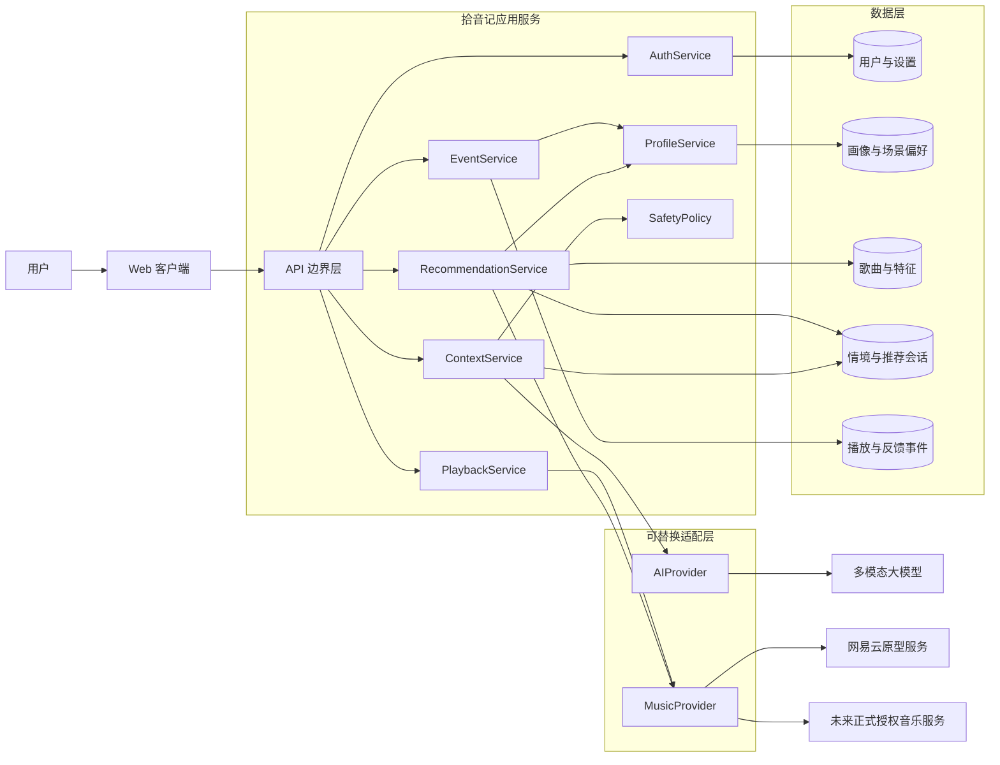
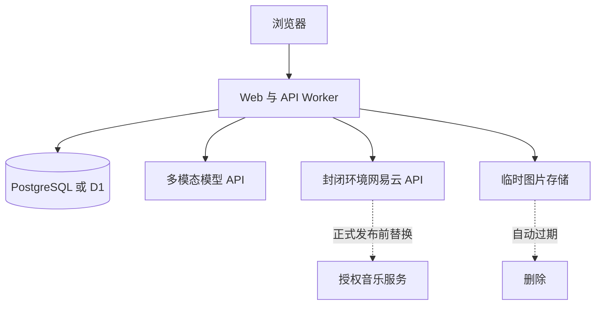

# 拾音记总体程序架构

## 1. 架构目标

第一阶段架构只服务于一个核心闭环：用户表达当下，系统理解情境，结合账号画像从真实可播放曲库中推荐歌曲，用户行为再反向改善画像。

架构必须满足：

- 大模型、音乐平台和部署环境可以替换。
- 推荐结果必须来自真实曲库 ID，而不是模型虚构的歌名。
- 播放权限是硬门槛，不参与概率猜测。
- 用户能知道系统理解了什么，并能修正。
- 每次推荐、播放和反馈都可追溯。
- 图片默认短暂处理，不长期保存原图。

## 2. 逻辑架构图



## 3. 服务边界

| 模块 | 单一职责 | 不应该负责 |
| --- | --- | --- |
| `AuthService` | 识别用户、会话和数据归属 | 推荐歌曲、保存音乐平台明文密码 |
| `ContextService` | 把文本和图片变成统一 `StructuredContext` | 直接生成最终歌名 |
| `SafetyPolicy` | 识别高风险表达并改变响应策略 | 心理诊断或治疗 |
| `RecommendationService` | 召回、过滤、打分、去重和解释 | 直接暴露第三方平台返回结构 |
| `PlaybackService` | 获取当前用户可用播放句柄并处理失效 | 绕过会员、地区或版权限制 |
| `ProfileService` | 读取画像、应用反馈、生成画像快照 | 用一次跳过永久拉黑歌曲 |
| `EventService` | 记录曝光、播放、跳过、反馈和错误 | 在请求链路中训练复杂模型 |
| `AIProvider` | 调用模型并保证结构化输出 | 持有业务数据库写权限 |
| `MusicProvider` | 屏蔽具体音乐平台接口差异 | 决定最终推荐排序 |

## 4. 部署形态

Web MVP 采用模块化单体，所有服务先放在同一个 TypeScript 应用中，通过目录和接口隔离。首版不拆微服务，避免鉴权、网络调用和部署复杂度掩盖产品验证。



推荐、模型和音乐平台内部可以并行演进，但浏览器只调用拾音记自己的 API，不能直接持有模型密钥、音乐凭据或数据库连接。

## 5. 建议代码边界

```text
app/
  api/v1/                       对外 HTTP API
  music-app.tsx                 当前产品界面
src/
  domain/                       StructuredContext、Track、Profile 等领域类型
  services/                     Context、Recommendation、Profile、Playback
  providers/ai/                 AIProvider 及具体模型实现
  providers/music/              MusicProvider 及网易云实现
  repositories/                 数据访问接口与实现
  policies/                     安全、隐私、可播放和推荐约束
  events/                       事件定义与写入
db/
  schema.ts                     数据模型
tests/
  unit/                         规则、打分和画像更新
  contract/                     Provider 与 API 契约
  integration/                  推荐和播放闭环
```

## 6. 核心设计决策

1. 先做模块化单体，接口边界按未来服务拆分设计。
2. 大模型输出情境结构，不直接输出最终歌曲列表。
3. 画像分长期偏好、场景偏好和短期状态，避免互相污染。
4. 可播放性、明确不喜欢和内容限制是硬过滤。
5. 排序分、过滤原因和画像版本必须随推荐结果保存，便于复盘。
6. 网易云第三方 API 只作为封闭原型的 `MusicProvider` 实现。
