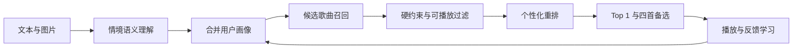
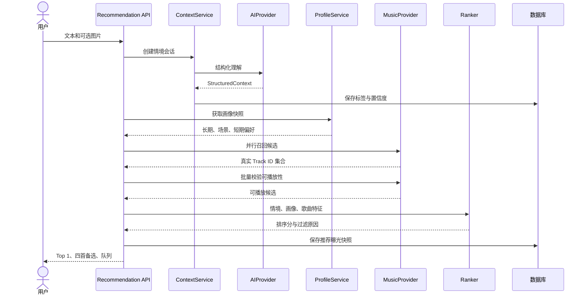
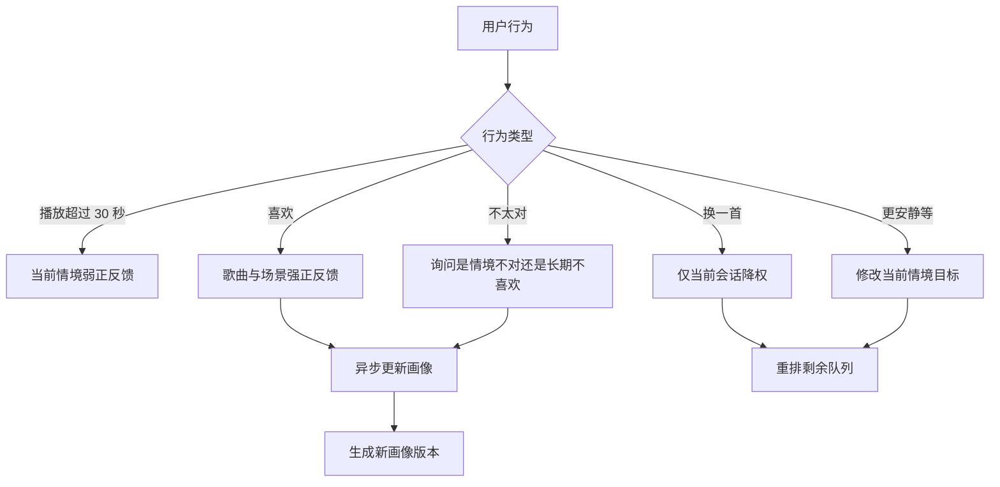

# 推荐引擎设计

## 1. 推荐问题的正确拆法

拾音记不是让大模型回答“现在适合听什么歌”，而是把大模型当作语义理解器。完整推荐需要经过六层：



大模型在第一层最有价值。其余层必须依赖真实数据和可解释规则，否则会出现歌名幻觉、无权播放、热门歌曲过度集中以及用户一次反馈污染长期画像等问题。

## 2. 统一情境模型

文本、图片和图文组合都必须输出同一份 `StructuredContext`：

```ts
type StructuredContext = {
  source: "text" | "image" | "text_image";
  currentMood: string[];
  targetMood: string[];
  activity: string | null;
  environment: string[];
  socialState: "alone" | "with_others" | "unknown";
  valence: number;       // -1 消极到 1 积极
  arousal: number;       // 0 平静到 1 激昂
  targetEnergy: number;  // 0 到 100
  lyricTolerance: "none" | "low" | "medium" | "high";
  familiarityBias: number; // 0 全探索到 1 全熟悉
  languagePreferences: string[];
  transition: string | null;
  hardConstraints: string[];
  safetyRisk: "none" | "watch" | "high";
  confidence: number;
};
```

模型调用必须使用 JSON Schema 或等价结构化输出，并在服务端做二次校验。字段缺失使用 `null` 或空数组，不能让模型补造用户没有表达的信息。

### 2.1 语义理解策略

- 文本负责情绪、意图、活动和明确约束。
- 图片负责环境、光线、空间、活动线索和视觉氛围。
- 图文冲突时，用户文字中的明确表达优先。
- `confidence < 0.55` 或关键字段冲突时，只追问一个问题。
- 高风险表达优先进入安全分支，音乐推荐只能作为附加行为。

## 3. 用户画像模型

画像不能只是“喜欢的歌单”。推荐请求需要同时读取五层数据：

| 画像层 | 示例 | 更新速度 | 推荐作用 |
| --- | --- | --- | --- |
| 明确偏好 | 喜欢陈粒、不听重金属、偏好华语 | 用户主动修改 | 强约束或高权重 |
| 长期音乐偏好 | 常听风格、歌手、年代、语种 | 慢 | 稳定个性化 |
| 场景画像 | 工作时少歌词，旅行时更开阔 | 中 | 同类场景重排 |
| 短期状态 | 最近连续听了舒缓歌曲 | 快速衰减 | 防止重复与情绪跳变 |
| 负反馈记忆 | 长期不喜欢、当前场景不合适 | 分层保存 | 过滤或降权 |

一次“换一首”只影响当前会话；明确“不喜欢这位歌手”才能进入长期负偏好。画像更新必须记录依据、权重和生效范围。

## 4. 候选召回

首版建议并行召回四个候选池，每个池返回真实曲库 ID：

1. 用户歌单与收藏中的熟悉歌曲。
2. 喜欢歌手、相似歌手和相似歌曲。
3. 根据情境标签检索的场景歌曲。
4. 人工维护的高质量场景种子曲库。

每个池先取 50 到 100 首，合并去重后进入过滤和排序。大模型可以生成检索标签，但不能直接把自己知道的歌名当候选。

## 5. 歌曲特征

推荐质量取决于歌曲是否具备可计算特征。首版至少需要：

- 平台 ID、歌名、歌手、专辑、语种、时长和可播放状态。
- 风格、年代、熟悉度、流行度和用户来源。
- 能量、速度、情绪倾向、歌词密度、器乐程度。
- 适用活动和环境标签。
- 人工标注置信度、模型标注置信度和用户反馈统计。

平台元数据不足时，可以用歌词摘要、标题和已有标签做离线模型标注；不要在每次在线推荐时重复标注整首歌。

## 6. 过滤与排序

### 6.1 硬过滤

以下条件不满足时直接剔除：

- 当前账号不可完整播放。
- 用户明确屏蔽的歌手、歌曲、风格或语种。
- 内容安全或年龄限制不满足。
- 与明确约束冲突，例如“不要歌词”却是高歌词密度。
- 同一会话最近已跳过或刚播放过。

### 6.2 首版排序公式

```text
score =
    0.35 * context_match
  + 0.20 * explicit_preference
  + 0.15 * scene_profile_match
  + 0.10 * long_term_affinity
  + 0.08 * familiarity_fit
  + 0.07 * transition_fit
  + 0.05 * exploration_value
  - repetition_penalty
  - negative_feedback_penalty
```

`context_match` 由结构化情境和歌曲特征计算，而不是让模型对每首歌自由打分。进入 Top 5 前再做歌手去重、风格多样性和能量梯度控制。

### 6.3 Top 1 与备选的不同目标

- Top 1：优先稳定命中，偏向用户熟悉且高度匹配的歌曲。
- 备选 1：与 Top 1 同方向，但替换歌手或声音质感。
- 备选 2：更安静或更有劲的邻近方向。
- 备选 3：承担适度探索。
- 备选 4：来自用户熟悉曲库，作为低风险回退。

## 7. 推荐时序



## 8. 反馈学习



画像更新应异步执行，推荐请求读取稳定快照。每次更新保留旧版本，出现异常推荐时能回答“为什么变了”。

## 9. 推荐效果验证

首轮不要只看点击喜欢，应同时记录：

- Top 1 在 30 秒内是否被跳过。
- 播放时长和播放完成率。
- 用户是否选择备选及其位置。
- 同一场景下一周内是否再次使用。
- “情境不对”和“长期不喜欢”的比例。
- 不可播放过滤率和播放地址获取失败率。
- 每个候选来源最终进入 Top 5 的比例。

建议建立 30 到 50 条人工标注情境和 100 到 300 首种子歌曲，先做离线回放测试，再邀请真实用户测试。
