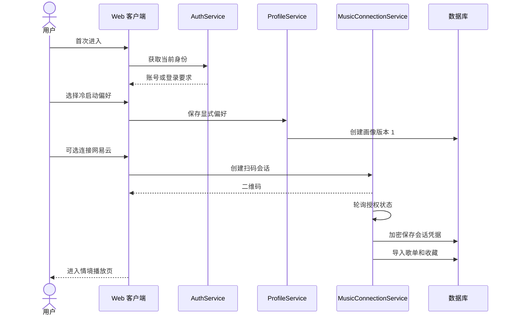
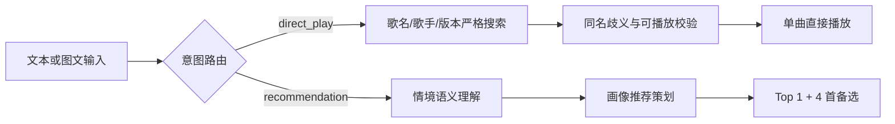
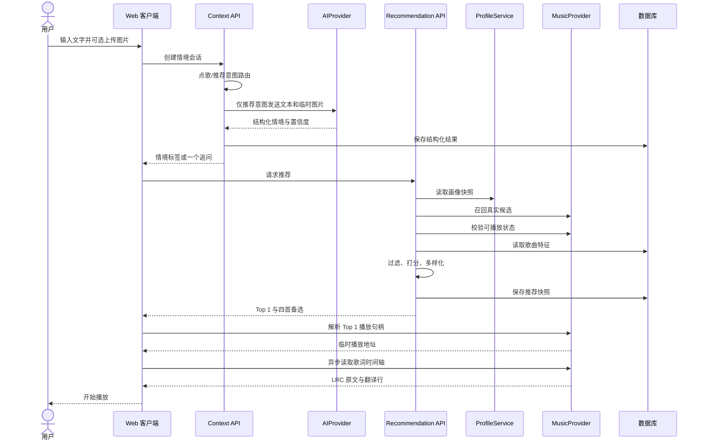
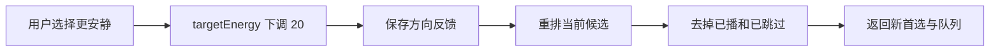
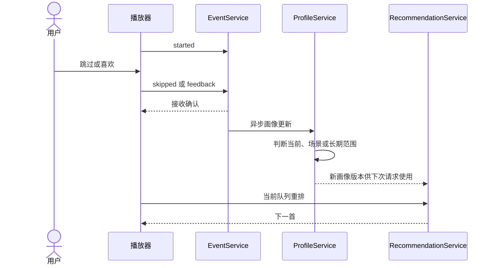
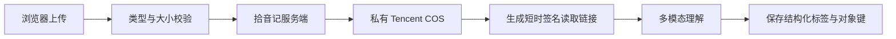
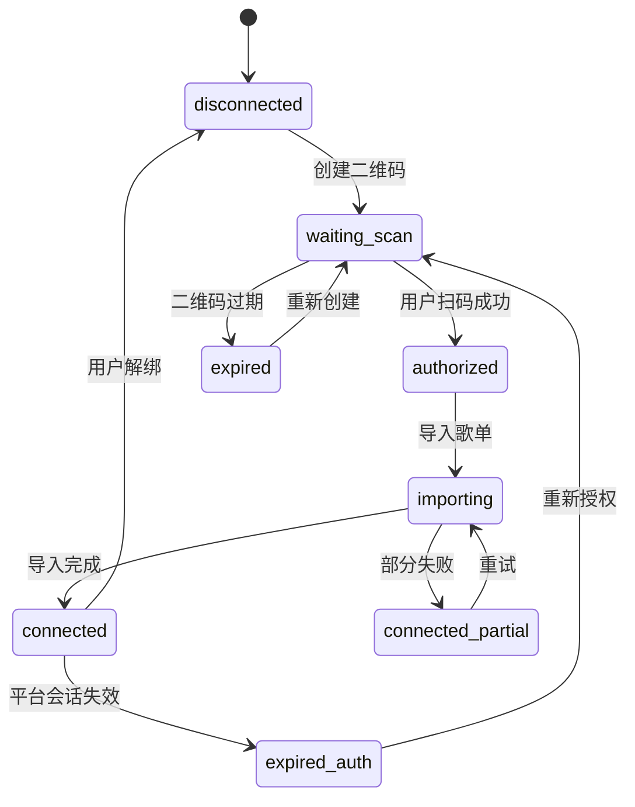

# 功能链路与时序

## 1. 首次使用

冷启动和音乐账号连接都允许跳过，不能阻塞用户体验情境推荐。未连接音乐账号时使用手动偏好和演示授权曲库。

## 2. 文本与图片推荐

输入首先经过确定性意图路由。明确的“播放/放首/想听 + 歌名”进入点歌链路；“放首安静的歌”等描述性输入继续进入情境推荐。

### 页面等待策略

- 情境解析目标 P75 小于 2 秒。
- 推荐和可播放过滤目标 P75 小于 3 秒。
- 播放解析目标 P75 小于 2 秒。
- 总体提交到出声目标 P75 小于 8 秒。
- 超时 5 秒先展示理解结果；播放失败自动尝试下一首。

## 3. 方向调整

用户点击“更安静”“更有劲”“更熟悉”或“更新鲜”时，不重新调用大模型理解整段输入，而是修改当前 `StructuredContext` 的明确维度并重排剩余候选。

只有候选不足时才重新召回，减少延迟和模型成本。

## 4. 播放与反馈

前端不能以按钮点击直接修改画像。所有画像变化都来自服务端事件处理，并保留可撤销记录。

## 5. 图片隐私链路

- 原图保存在私有 COS；数据库不保存可访问链接，只保存对象键和必要元数据。
- 视觉模型仅接收短时签名读取链接，默认有效期 10 分钟。
- 原图留存、用户删除入口和生命周期规则见 `08-context-image-storage.md`；在规则上线前不得把“不会长期保存”作为前端承诺。

## 6. 音乐账号连接

凭据只在服务端加密存储。解绑后立即删除凭据，已导入的画像数据是否保留应由用户选择。

## 7. 降级策略

| 异常 | 用户体验 | 系统动作 |
| --- | --- | --- |
| 大模型超时 | 使用最近一次同类场景或规则解析，并明确提示 | 记录模型错误，不伪造高置信度 |
| 图片无法理解 | 保留文字输入并询问一个问题 | 删除临时图片 |
| 音乐平台不可用 | 展示稍后重试或切换演示授权曲库 | 不绕过平台限制 |
| Top 1 不可播放 | 自动尝试下一首并记录失败 | 刷新可播放缓存 |
| 候选不足 | 放宽软偏好，不放宽硬约束 | 记录召回缺口 |
| 画像不可用 | 使用本次情境和冷启动偏好 | 不阻塞推荐 |
| 事件上报失败 | 本地短暂排队后重试 | 使用事件 ID 去重 |
