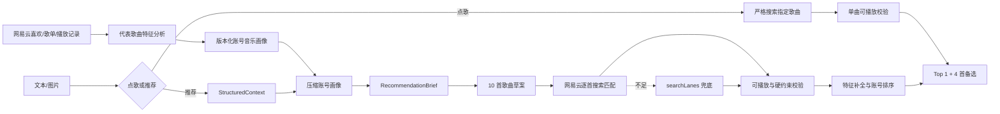

# 当前完成度与实施顺序

## 1. 当前版本结论

Demo V1 已形成可本地验证的真实闭环：文本、图片或图文输入先由 GLM 转换成结构化情境；第二次模型调用结合压缩账号画像生成推荐策略与歌曲草案；网易云本地服务逐首搜索歌名和歌手、匹配真实 Track ID、校验可播放性、补充歌曲特征，最后由规则排序器返回 Top 1 和四首备选。

当前最需要验证的已经从“链路能不能跑”转为“模型提出的歌曲是否稳定适合情境，以及平台能否准确匹配这些草案”。免费 GLM Flash 偶发返回 `429` 容量繁忙，因此真实测试需要记录模型可用率和响应时间，不能只看单次推荐结果。

## 2. 已完成

| 能力 | 状态 | 当前实现 |
| --- | --- | --- |
| 情境理解 | 已完成 V1 | `glm-4.7-flash` 处理文本，`glm-4.6v-flash` 处理图片/图文，输出固定 Schema |
| 点歌意图 | 已完成 V1 | 在大模型前识别明确歌名请求；未指定歌手时接受任意歌手版本，指定歌手时严格校验，只返回一首并直接解析播放 |
| 情境评测 | 已完成 V1 | 旅游、学习、工作、情绪陪伴共 32 条测试，最近得分 0.94375 |
| 推荐策划 | 已完成 V1 | 独立 `RecommendationPlanner` 基于情境和压缩画像生成 `RecommendationBrief` 与 10 首歌曲草案 |
| 探索模式 | 已完成基础层 | 支持 `auto`、`familiar`、`balanced`、`explore`；可明确排除歌单内歌曲 |
| 草案搜索确认 | 已完成 V1 | 以歌名、歌手、专辑和版本计算匹配分，拒绝错歌手、错版本和低置信度结果 |
| 可播放校验 | 已完成 V1 | 使用账号会话检查权限，拒绝试听片段和不可播放歌曲 |
| 账号音乐画像 | 已完成 V1 | 同步喜欢列表、歌单和播放记录，分析代表歌曲的曲风、语种、能量、歌词倾向与主题，生成可版本化的长期偏好和场景偏好簇 |
| 画像持久化与刷新 | 已完成 V1 | 保存账号曲库证据、全局歌曲特征缓存和画像快照；提供画像查询/同步 API 与 Web 刷新入口 |
| 画像显式修正 | 已完成 V1 | 用户可编辑喜欢/不喜欢的曲风与歌手、常听语言和熟悉度倾向，保存后直接参与推荐排序 |
| 歌曲特征 | 已完成 V1 | 从歌词、歌曲百科和规则推断曲风、歌词密度、能量、情绪与熟悉度，并记录来源置信度 |
| 混合排序 | 已完成 V1 | 模型草案和搜索兜底进入统一硬约束过滤、账号二次排序和歌手多样化 |
| 降级链路 | 已完成 V1 | 推荐策划失败时回退到情境搜索；草案不足时用 `searchLanes` 补充候选 |
| 推荐诊断 | 已完成基础层 | API 返回草案数、匹配数、兜底数和结构化失败原因，供开发期验证 |
| 真实播放 | 已接通 | 通过网易云本地服务解析当前账号可用的完整播放 URL |
| 同步歌词 | 已接通 | 独立歌词 API 解析 LRC 时间轴和翻译行；播放器按进度高亮、自动滚动并支持点击跳转 |
| 账号连接 | 已接通 | 二维码登录为主；Cookie 只保存在服务端内存，不进入前端和模型 |
| 数据与反馈 | 已接通 | D1 保存情境、推荐、曲目、播放事件、喜欢/不喜欢和方向反馈 |
| 自动验证 | 已完成基础项 | 类型检查、生产构建、SSR 测试和 42 条单元测试 |

## 3. 当前限制

| 限制 | 影响 | 当前处理 |
| --- | --- | --- |
| 免费 GLM 容量波动 | 偶发 `429`，首次理解可能失败 | 最多重试 3 次；推荐策划失败自动降级；测试时单独记录可用率 |
| 草案搜索并非全量曲库 | 模型知道的歌曲可能在当前地区、账号或曲库中不可用 | 一次生成 10 首，逐首搜索并记录 `not_found`、`search_mismatch`、`not_playable` |
| 网易云搜索可能返回同名、翻唱、Live | 可能搜到错误版本 | 标题、歌手、专辑、版本联合评分，低于 0.72 不采用 |
| 歌词和百科接口较慢 | 首次推荐时延会上升 | 单项补全 3 秒超时、不重试，失败时使用可解释的规则特征 |
| 账号会话只在进程内存 | 重启 Web 服务后需重新扫码 | MVP 可接受；硬件或多人测试前迁移到加密会话存储 |
| 尚无线上版权服务合同 | 不能公开商用 | 当前仅限本机封闭研发与验证，不部署为公开音乐服务 |

## 4. 当前主链路



## 5. 本地验证

保持网易云本地服务运行在 `http://localhost:4000`，并在本地环境中配置模型变量后执行：

```powershell
npm run smoke:recommendation -- "在陌生城市夜里散步，想听点没听过但别太吵，不要我歌单里的"
```

输出只包含情境、策略统计、草案解析状态和最终歌曲，不输出 API Key、Cookie 或账号凭据。重点观察：

- `matchedDraftCount`：模型草案被平台准确确认的数量。
- `failureCounts`：失败主要来自模型选歌、搜索错配、版权还是硬约束。
- `source`：最终歌曲来自模型草案还是搜索兜底。
- `recommendationMs`：第二次模型调用、搜索和特征补全的总耗时。

## 6. 下一阶段

1. 建立 20 条探索推荐测试集，固定记录歌曲草案、匹配结果、Top 5 和人工评分。
2. 连续运行多轮真实冒烟，评估 GLM 策划稳定性、草案匹配率和 429 可用率。
3. 根据失败样本调整推荐提示词、歌名匹配阈值和 `searchLanes` 兜底策略。
4. 增加草案回补调用：把失败原因交回模型，再补生成 5 到 10 首，尽量减少宽泛搜索兜底。
5. 增加候选重排模型，但只允许它从真实、可播放的 Track ID 中选择。
6. 在 Web 界面增加“更熟悉 / 更新鲜”控制和推荐来源展示。
7. 将当前同步式画像刷新迁移为后台任务，并增加增量刷新、失败重试和画像版本对比。
