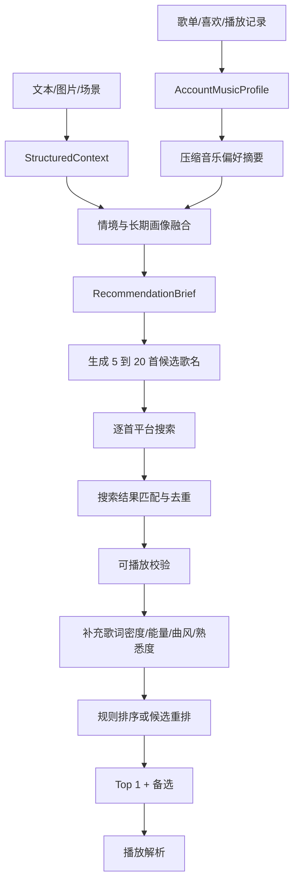

# 新歌探索与开放曲库推荐设计

## 1. 问题定义

只从用户歌单里推荐，会让产品变成“个人曲库重排器”。这能提升命中稳定性，但无法覆盖两类真实需求：

- 用户明确说“想听点没听过的”“来点新鲜的”“不要我歌单里的”。
- 当前情境需要一种用户还没有收藏过的声音，例如旅行、公路、城市夜景、独处疗愈、学习白噪感、工作提神等。

但另一端也不能让大模型直接输出它记忆里的歌名。原因是：

- 大模型不拥有完整曲库，也不知道当前平台是否可播放。
- 同名歌曲、翻唱版本、Live 版本、版权限制会让“歌名推荐”变得不可靠。
- 模型容易偏向大众热门歌，导致探索结果看起来新，其实很窄。

所以拾音记的探索推荐应当采用“先理解用户长期音乐偏好，再理解当前情境，拾音记生成情境候选，音乐平台负责搜索确认，推荐服务负责过滤、排序和播放衔接”的结构。MVP 阶段先默认音乐平台只可靠提供账号歌单读取、歌曲信息读取、搜索和播放解析能力。

这里必须拆开两个容易混淆的问题：

- **这首歌能否用于理解用户**：用户歌单、喜欢列表和播放记录默认可以作为音乐偏好证据，但受个性化开关控制。
- **这首歌能否进入本次推荐**：由当前 `DiscoveryIntent` 决定；用户说“不要歌单里的”时，只排除候选，不丢弃已经从歌单中学到的偏好。

因此，`explore` 不是“忘掉用户后随机找新歌”，而是“保持用户的音乐偏好坐标，搜索坐标附近但尚未收藏的新歌”。

## 2. 推荐与画像边界

推荐系统需要同时支持三种候选来源，但在 MVP 阶段要按“搜索型音乐平台”来设计：

| 来源 | 作用 | 风险 | 使用方式 |
| --- | --- | --- | --- |
| 用户库 | 稳定命中，贴合长期偏好 | 容易重复、不够新鲜 | Top 1 默认可偏熟悉，或作为低风险备选 |
| 平台开放搜索 | 确认歌曲是否存在、拿到平台 Track ID | 搜索结果可能错配 | 用“歌名 + 歌手 + 版本约束”精确搜索 |
| 情境候选生成 | 发现新歌、扩展风格和场景 | 可能生成不存在或不可播歌曲 | 由拾音记生成候选，再用平台搜索校验 |

这里的“开放曲库”不是世界上所有音乐，而是当前接入音乐服务在当前账号、地区、会员状态下可检索且可播放的曲库。MVP 阶段可以先以本地网易云 API 返回结果作为探索边界。

推荐系统对用户库需要维护两个互不替代的状态：

```ts
type UserLibraryPolicy = {
  useForProfiling: boolean;   // 是否允许用于构建长期音乐画像
  allowAsCandidates: boolean; // 本次推荐是否允许播放用户库歌曲
};
```

典型组合：

| 用户意图 | `useForProfiling` | `allowAsCandidates` | 实际含义 |
| --- | --- | --- | --- |
| 默认推荐 | `true` | `true` | 用画像，也允许推荐熟悉歌曲 |
| 不要歌单里的 | `true` | `false` | 用歌单理解偏好，只推荐库外歌曲 |
| 关闭个性化 | `false` | `false` | 不读取画像，只根据当前情境推荐 |
| 只听收藏 | `true` | `true` | 候选范围进一步限制为用户库 |

## 3. 账号音乐画像层

### 3.1 画像目标

用户画像不应只是“喜欢的歌手和歌单标签”，而应形成一份可计算、可解释、可更新的 `AccountMusicProfile`。它描述的是音乐消费偏好，不是人格测评。

```ts
type WeightedPreference = {
  value: string;
  weight: number;      // 0 到 1
  confidence: number;  // 0 到 1
  evidenceCount: number;
};

type AccountMusicProfile = {
  userId: string;
  version: number;
  analyzedAt: string;
  sourceCoverage: {
    playlistCount: number;
    libraryTrackCount: number;
    analyzedTrackCount: number;
    lyricTrackCount: number;
    historyTrackCount: number;
  };
  genres: WeightedPreference[];
  languages: WeightedPreference[];
  artists: WeightedPreference[];
  lyricThemes: WeightedPreference[];
  playlistThemes: WeightedPreference[];
  preferredEnergy: { center: number; range: [number, number]; confidence: number };
  preferredValence: { center: number; range: [number, number]; confidence: number };
  lyricPreference: {
    instrumentalRatio: number;
    preferredDensity: "none" | "low" | "medium" | "high";
    narrativeStrength: number;
  };
  diversity: {
    artistDiversity: number;
    genreDiversity: number;
    noveltyTolerance: number;
  };
  representativeTracks: Array<{
    providerTrackId: string;
    title: string;
    artist: string;
    source: "liked" | "playlist" | "history";
    weight: number;
  }>;
  negativePreferences: {
    artists: WeightedPreference[];
    genres: WeightedPreference[];
    features: WeightedPreference[];
  };
};
```

“定性”只能输出类似以下音乐偏好结论：

- 偏好中低能量、旋律明确、歌词密度中等的华语独立流行。
- 工作场景更接受器乐和轻电子，旅行场景能接受更高能量。
- 熟悉歌手集中，但曲风跨度较大，新歌探索应从相邻歌手开始。

禁止从歌词或歌单推断“内向”“抑郁”“失恋”“收入”“疾病”“政治倾向”等人格、健康或敏感属性。歌词只能用于提取音乐内容主题、语言、叙事强度和情绪表达，不用于给用户做心理诊断。

### 3.2 已确认的网易云数据来源

本地 `ncm-api-enhanced` 文档已经确认以下接口可用于画像构建：

| 数据 | 接口 | 用途 |
| --- | --- | --- |
| 用户歌单 | `/user/playlist` | 获取歌单 ID、名称、标签和分页信息 |
| 歌单全部歌曲 | `/playlist/track/all` | 获取歌单中的完整歌曲列表，支持分页 |
| 喜欢列表 | `/likelist` | 确认高权重喜欢歌曲 ID |
| 播放记录 | `/user/record` | 识别重复收听、近期活跃歌曲和熟悉歌手 |
| 歌曲详情 | `/song/detail` | 获取歌名、歌手、专辑、时长等基础信息 |
| 歌词 | `/lyric` | 提取语言、歌词密度、主题与叙事强度 |
| 音乐百科 | `/song/wiki/summary` | 尽可能补充曲风、BPM 和歌曲标签 |

这些接口的职责是提供画像证据，不能直接替代拾音记自己的特征提取和偏好聚合。

### 3.3 歌曲特征提取

每首用于画像分析的歌曲生成统一的 `TrackTasteFeatures`：

```ts
type TrackTasteFeatures = {
  providerTrackId: string;
  genres: string[];
  language: string | null;
  energy: number;
  valence: number;
  lyricDensity: "none" | "low" | "medium" | "high";
  lyricThemes: string[];
  narrativeStrength: number;
  instruments: string[];
  era: string | null;
  playlistContexts: string[];
  provenance: Record<string, "metadata" | "playlist" | "lyrics" | "wiki" | "model" | "inferred">;
  confidence: number;
};
```

提取优先级：

1. 歌曲详情确定歌名、歌手、专辑、时长和版本。
2. 歌单名称与歌单标签提供场景和人工分类线索。
3. 歌词确定是否纯音乐、语言、歌词密度、常见主题和叙事强度。
4. 音乐百科尽可能提供曲风、BPM、乐器等结构化信息。
5. 缺失字段再由规则或模型推断，并降低置信度。

不应把歌名直接当成用户情绪。例如歌单中存在“孤独”或“失恋”歌曲，只能说明用户消费过相关内容，不能说明用户当前或长期处于该状态。

### 3.4 证据权重与聚合

不同来源的行为强度不同，建议第一版使用以下基础权重：

| 证据 | 基础权重 | 说明 |
| --- | ---: | --- |
| 主动喜欢 | 1.00 | 最明确的正向偏好 |
| 高频重复播放 | 0.80 到 1.00 | 使用对数归一化，避免播放次数极端放大 |
| 用户自建歌单 | 0.75 | 需要结合歌单名称、标签和歌曲位置 |
| 收藏的外部歌单 | 0.50 | 可能只是临时收藏，权重低于自建歌单 |
| 单次播放记录 | 0.25 | 只作为弱证据 |
| 跳过、不喜欢 | -0.50 到 -1.00 | 后续接入行为反馈后作为负向证据 |

聚合时还需要：

- 单一歌手最多贡献一定比例，避免一个大歌单把画像变成“只喜欢某歌手”。
- 大歌单按抽样和归一化计权，不能让 1000 首歌的歌单完全覆盖其他证据。
- 最近 30 到 90 天行为具有时间加权，但长期喜欢列表不快速衰减。
- 每个结论保留 `evidenceCount`、`confidence` 和特征来源，低覆盖率时不要输出强结论。
- 画像保留多个偏好簇，例如“学习器乐”和“旅行流行”，不要把多样口味平均成一个不存在的中间风格。

### 3.5 同步与更新链路

画像构建是账号连接后的异步任务，不应阻塞每次推荐：


MVP 建议：

- 保存全部歌单 Track ID 和基础元数据，用于判断歌曲是否属于用户库。
- 首次只分析 100 到 200 首加权代表歌曲，而不是同步分析整个曲库。
- 歌曲特征按平台 Track ID 缓存；同一首歌被多个用户收藏时只分析一次。
- 登录后启动首次同步，之后每日增量更新，也允许用户手动刷新画像。
- 推荐请求只读取最新画像摘要；画像任务失败时使用上一版本，不让推荐接口等待全量歌词分析。

### 3.6 长期画像与当前情境融合

推荐目标由长期偏好、当前情境和探索意图共同决定：

```text
recommendation_target =
    context_vector * context_weight
  + account_taste_vector * profile_weight
  + discovery_vector * novelty_weight
```

建议初始权重：

| 模式 | 当前情境 | 长期画像 | 探索信号 |
| --- | ---: | ---: | ---: |
| `familiar` | 0.35 | 0.55 | 0.10 |
| `balanced` | 0.45 | 0.40 | 0.15 |
| `explore` | 0.45 | 0.35 | 0.20 |

即使在 `explore` 模式，长期画像仍保留 0.35 左右的影响，只是 `allowAsCandidates=false`，防止歌单歌曲进入结果。若用户当次明确要求与长期画像冲突，例如“我平时听摇滚，但现在只想听安静钢琴”，当前明确指令和硬约束优先，画像只作为弱先验，不能把用户锁死在旧偏好中。

### 3.7 隐私、版权与可纠正性

- 完整歌词只在特征提取阶段临时使用，长期保存主题、密度、语言等派生特征，不保存整份歌词原文。
- 外部模型只接收压缩后的音乐画像和必要代表歌曲，不接收网易云 Cookie、手机号、平台用户 ID 或完整歌单。
- 账号内保存的 `userId` 用于数据归属，但发送给模型前必须移除。
- 每个画像结论都应能查看证据和置信度，用户可以删除、纠正或关闭个性化。
- 关闭个性化后停止读取画像参与推荐；是否删除已有画像应提供独立操作，不能暗中继续使用。
- 画像版本更新不能覆盖历史推荐使用的版本号，否则无法解释过去为什么推荐某首歌。

## 4. 用户意图：熟悉、混合、探索

`StructuredContext.familiarityBias` 需要从一个排序因子升级为推荐模式信号：

```ts
type DiscoveryMode = "familiar" | "balanced" | "explore";

type DiscoveryIntent = {
  mode: DiscoveryMode;
  noveltyLevel: number; // 0 到 1，越高越偏新歌
  useAccountProfile: boolean;
  allowUserLibrary: boolean;
  allowAdjacentArtists: boolean;
  allowPlatformSearch: boolean;
  excludedSources: Array<"liked" | "playlist" | "history">;
  reason: string;
};
```

`useAccountProfile` 与 `allowUserLibrary` 不应绑定。用户说“不要歌单里的”只修改后者；只有关闭个性化，才把前者设为 `false`。

识别规则建议：

- “想听熟悉的”“不要冒险”“来首我喜欢的”：`familiar`
- “给我推荐”“适合现在就行”：`balanced`
- “新歌”“没听过”“不要歌单里的”“发现一下”：`explore`

如果用户明确说“不想听自己歌单里的”，则 `allowUserLibrary=false`，但 `useForProfiling` 仍保持为 `true`。系统不播放用户库歌曲，却继续使用 `AccountMusicProfile` 寻找相似能量、语种、歌词偏好、主题表达和曲风结构的新候选。只有用户关闭个性化时，才停止读取和使用账号音乐画像。

## 5. 两阶段大模型职责

### 5.1 情境理解

第一阶段仍然由 GLM 把文本、图片或图文输入解析为 `StructuredContext`：

- 当前心情
- 目标心情
- 活动场景
- 环境线索
- 能量需求
- 歌词容忍度
- 熟悉/探索倾向
- 硬约束

这一阶段不推荐歌曲。

### 5.2 探索策略规划

第二阶段让模型基于 `StructuredContext` 和版本化 `AccountMusicProfile` 的压缩摘要生成 `RecommendationBrief`。模型输入应包含高置信度偏好、多个偏好簇、代表歌曲、负向偏好、画像覆盖率与版本，不应只传几项歌单标签。在搜索型音乐平台下，它需要同时包含“声音目标”和“候选歌单草案”，但候选草案仍不是最终结果，必须经过平台搜索确认。

```ts
type RecommendationBrief = {
  discoveryIntent: DiscoveryIntent;
  profileBasis: {
    profileVersion: number | null;
    profileConfidence: number;
    matchedPreferenceClusters: string[];
    appliedSignals: string[];
    overriddenByCurrentRequest: string[];
  };
  desiredSound: {
    energyRange: [number, number];
    lyricDensity: "none" | "low" | "medium" | "high";
    genres: string[];
    moods: string[];
    instruments: string[];
    tempoWords: string[];
    languagePreferences: string[];
  };
  searchLanes: Array<{
    lane: "scene" | "mood" | "genre" | "artist_adjacent" | "playlist_style" | "fresh";
    query: string;
    weight: number;
    expectedRole: "top_pick" | "alternative" | "exploration";
  }>;
  avoid: {
    genres: string[];
    moods: string[];
    artists: string[];
    tracks: string[];
    reasons: string[];
  };
  draftTracks: Array<{
    title: string;
    artist?: string;
    album?: string;
    versionHint?: "studio" | "live" | "acoustic" | "remix" | "any";
    fitReason: string;
    riskNotes: string[];
  }>;
  explanationFocus: string[];
};
```

模型可以生成“搜索车道”“声音目标”和“候选歌名草案”，但不能生成最终曲目 ID。`profileBasis` 必须说明本次推荐具体使用了哪些画像信号，以及哪些长期偏好被当前明确要求覆盖。最终候选必须来自音乐平台搜索结果或本地已导入曲库。

## 6. 搜索型音乐平台主链路

如果音乐平台只提供搜索能力，情境推荐主链路应当改为：



### 6.1 候选歌名生成

候选歌名生成不是让模型随便回答“推荐五首”。它需要带着约束生成：

- 必须解释每首歌为什么适合当前情境。
- 每首歌尽量给出歌手，减少同名错配。
- 尽量避免只输出超级热门歌。
- `explore` 模式优先生成用户歌单外的歌曲。
- `explore` 模式仍必须符合账号画像中的高置信度曲风、能量、语种、歌词偏好或相邻偏好簇，除非用户明确要求跳出既有口味。
- `familiar` 模式可以优先生成用户库歌曲或用户熟悉歌手。
- 学习、工作等低干扰场景要优先低歌词密度、低突兀转折。

建议一次生成 10 到 20 首草案，不是只生成 5 首。原因是平台搜索、版权、会员、版本错配会淘汰一部分，最终再收敛到 5 首可播放结果。

### 6.2 平台搜索确认

每个草案进入平台搜索时，应按优先级尝试：

1. `歌曲名 + 歌手名`
2. `歌曲名 + 专辑名`
3. `歌曲名`

搜索结果不能直接取第一条，需要做匹配评分：

```text
match_score =
    0.45 * title_similarity
  + 0.30 * artist_similarity
  + 0.10 * album_similarity
  + 0.10 * version_match
  + 0.05 * duration_reasonable
```

低于阈值的搜索结果应丢弃，并记录为 `search_mismatch`。如果同一首歌出现多个版本，优先选择录音室版；除非情境明确需要 Live、Acoustic 或 Remix。

### 6.3 可播放与回补

搜索确认后必须立刻做可播放校验。若不足 5 首：

- 第一轮：从同一 `RecommendationBrief` 的剩余草案继续搜索。
- 第二轮：让模型基于失败原因补生成 5 到 10 首候选。
- 第三轮：回退到搜索车道关键词召回，再由规则排序挑选。

失败原因要结构化传回模型，例如：

```ts
type DraftTrackFailure = {
  title: string;
  artist?: string;
  reason: "not_found" | "search_mismatch" | "not_playable" | "duplicate" | "violates_constraints";
};
```

这样第二轮补生成时，模型不会重复给出同一批不可用歌曲。

## 7. 候选召回设计

### 7.1 熟悉池

来源：

- 喜欢列表
- 用户歌单曲目
- 最近播放
- 高完成率曲目

用途：

- `familiar` 模式下作为主要候选。
- `balanced` 模式下占 30% 到 50%。
- `explore` 模式下默认不进入 Top 1，可作为备选兜底。

### 7.2 邻近探索池

来源：

- 喜欢歌曲的相近歌手、相近风格和相近年代，由模型根据用户画像生成草案
- 常听歌手的相似歌手，如果平台暂无相似接口，则由模型给出歌手邻近方向再搜索
- 用户高频风格下的陌生歌手
- 用户歌单中高频标签对应的平台歌单或搜索结果

用途：

- 解决“不要歌单里的，但仍要像我”的需求。
- 这是 MVP 最值得优先做的探索池，因为它比纯关键词搜索更稳。

### 7.3 情境探索池

来源：

- `RecommendationBrief.draftTracks`
- `RecommendationBrief.searchLanes`
- 平台搜索接口确认真实 ID
- 场景种子词，例如“夜间散步”“专注学习”“公路旅行”“雨天独处”

用途：

- 解决用户当前场景和长期偏好之间的差距。
- 需要严格去噪，因为搜索结果可能只命中标题，不一定命中声音特征。

### 7.4 新鲜度池

来源：

- 模型基于当前场景生成陌生歌手或低熟悉度候选草案
- 平台新歌榜、飙升榜、编辑歌单、风格榜单，如果后续 API 可用再接入
- 当前阶段先用“候选歌名草案 + 平台搜索确认”实现

用途：

- 解决“真的想发现新东西”的需求。
- 排序时要避免只推流行榜头部，可以加入低重复、低历史曝光、多歌手分散约束。

## 8. 排序策略

探索推荐不是简单把熟悉度降到最低，而是在“情境匹配”和“新鲜度”之间做平衡。

```text
score =
    0.28 * context_match
  + 0.24 * profile_affinity
  + 0.16 * discovery_fit
  + 0.12 * playability_confidence
  + 0.10 * audio_feature_fit
  + 0.08 * diversity_value
  + 0.02 * freshness_value
  - repetition_penalty
  - source_conflict_penalty
```

不同模式的权重应当变化：

| 模式 | Top 1 倾向 | 备选结构 |
| --- | --- | --- |
| `familiar` | 高画像匹配、高熟悉度 | 1 首探索，其余熟悉或邻近 |
| `balanced` | 情境匹配优先，允许半熟悉 | 2 首邻近探索，1 首情境探索，1 首熟悉兜底 |
| `explore` | 情境匹配 + 新鲜度优先 | 至少 3 首非用户库歌曲，保留 1 首相似邻近 |

硬约束始终优先于模式。例如用户说“学习，不要歌词”，即使探索模式也不能推荐高歌词密度歌曲。

## 9. 大模型重排的安全边界

可以让模型参与最终重排，但输入必须是“真实候选列表”，输出必须只允许选择候选中的 ID。

```ts
type CandidateRerankInput = {
  context: StructuredContext;
  brief: RecommendationBrief;
  profileSummary: ProfileSummary;
  candidates: Array<{
    id: string;
    title: string;
    artist: string;
    source: string;
    features: TrackFeatures;
    reasonsFromRetriever: string[];
  }>;
};

type CandidateRerankOutput = {
  selectedIds: string[];
  rejectedIds: Array<{ id: string; reason: string }>;
  explanationById: Record<string, string>;
};
```

服务端必须校验：

- `selectedIds` 全部存在于候选池。
- 不可播放曲目不能进入结果。
- 被用户明确排除的曲目、歌手、风格不能进入结果。
- 如果模型输出了不存在的 ID，丢弃该项并记录 `llm_hallucinated_candidate_id`。
- 模型超时或输出异常时，回退到规则排序。

## 10. API 与数据结构影响

建议后续新增或扩展这些内部能力：

| 能力 | 说明 |
| --- | --- |
| `POST /api/v1/recommendations` 增加 `discovery_mode` | 允许前端传入 `auto`、`familiar`、`balanced`、`explore` |
| `MusicProvider.searchAndMatchDraftTracks` | 输入候选歌名草案，返回平台搜索确认后的真实候选 |
| `MusicProvider.retrieveCandidates` 支持搜索车道 | 当候选歌名不足时，使用 `RecommendationBrief.searchLanes` 兜底搜索 |
| `MusicProvider.retrieveSimilarTracks` | 后续平台能力允许时再接入，MVP 不依赖 |
| `PlaylistSyncService` | 分页同步用户歌单、喜欢列表和播放记录，维护用户曲库快照 |
| `TrackTasteFeatureExtractor` | 结合详情、歌词、百科、歌单上下文生成可缓存的歌曲偏好特征 |
| `AccountMusicProfileBuilder` | 按证据权重聚合多个偏好簇，生成版本化账号音乐画像 |
| `ProfileService.getCompressedTasteProfile` | 给模型高置信度画像摘要，避免每次发送完整歌单或完整歌词 |
| `POST /api/v1/profile/music/sync` | 手动触发画像增量同步，返回任务状态而不是阻塞等待 |
| `GET /api/v1/profile/music` | 返回用户可理解的音乐画像摘要、覆盖率、版本和更新时间 |
| `RecommendationPlanner` | 调 GLM 生成 `RecommendationBrief` 和候选歌名草案 |
| `CandidateReranker` | 调 GLM 从真实候选中选择和解释 |
| `RecommendationExperiment` | 记录 baseline、规则重排、模型重排效果差异 |

数据表或本地缓存建议补充：

- `user_playlists`：歌单 ID、名称、标签、所有者类型、更新时间和同步游标。
- `user_library_tracks`：用户歌单、喜欢、最近播放导入快照，并记录来源、行为权重和歌单归属。
- `track_taste_features`：按平台 Track ID 缓存歌词、曲风、能量、主题等特征及置信度。
- `account_music_profile_versions`：保存账号音乐画像版本、覆盖率、聚合结果和生成时间。
- `account_profile_evidence`：保存每个画像结论由哪些歌曲特征和行为证据支持，便于解释和纠错。
- `track_candidate_sources`：每首候选来自哪个召回池、哪个搜索车道。
- `recommendation_briefs`：保存模型生成的策略包、候选歌名草案和版本。
- `draft_track_resolution_logs`：保存草案歌曲到平台搜索结果的匹配、失败和回补记录。
- `recommendation_rerank_logs`：保存候选数量、模型选择、丢弃原因、回退原因。
- `track_exposure_stats`：记录某首歌对某用户展示过几次，用于新鲜度和重复惩罚。

## 11. Web MVP 交互建议

MVP 不需要把复杂策略暴露给用户，但应提供一个轻量选择：

- 默认：自动播放一首最合适的。
- 控制项：`更熟悉`、`更新鲜`。
- 输入理解：当用户文本里出现“新歌”“不要歌单”“没听过”，自动进入探索模式。
- 展示解释：每首歌显示“来自你的偏好延展”“来自当前场景”“来自新鲜探索”等简短来源。
- 画像入口：允许用户查看“偏好曲风、能量、歌词倾向、代表歌手、画像更新时间和覆盖率”。
- 画像控制：允许刷新画像、纠正明显偏好、关闭个性化；关闭后推荐链路不得读取歌单画像。

这样用户能感受到系统真的理解了“此刻想发现”，而不是只把搜索词换了一遍。

## 12. 验证指标

探索推荐需要单独验证，不能只看整体点击率。

| 指标 | 目标 |
| --- | --- |
| 探索曲目占比 | `explore` 模式 Top 5 至少 60% 不在用户库 |
| 可播放率 | 进入 Top 5 的曲目 100% 可播放 |
| 30 秒跳过率 | 与熟悉模式分开统计 |
| 新鲜接受率 | 用户播放超过 60 秒或点击喜欢 |
| 重复曝光率 | 同一用户 7 天内重复推荐同一首歌的比例 |
| 画像贴合度 | 新歌是否仍符合语言、风格、歌词密度等偏好 |
| 召回来源贡献 | 熟悉池、邻近池、情境池、新鲜池进入 Top 5 的比例 |
| 草案解析成功率 | 模型给出的候选歌名能被平台搜索确认的比例 |
| 搜索错配率 | 搜索结果被匹配阈值丢弃的比例 |
| 画像覆盖率 | 已分析代表歌曲数 / 计划分析代表歌曲数，并按数据来源分别统计 |
| 画像稳定性 | 同一曲库重复构建时主要偏好权重的波动 |
| 画像可解释率 | 画像结论能追溯到有效歌曲或行为证据的比例 |
| 库外画像贴合度 | `explore` 结果不在用户库，但仍符合高置信度画像维度的比例 |
| 画像新鲜度 | 歌单变化后画像完成增量更新所需时间 |

第一轮离线测试可以准备 20 个探索场景：

- “在陌生城市夜里散步，想听点没听过但别太吵”
- “学习两个小时有点困，来点新鲜的但不要歌词太密”
- “今天心情很低，不想听收藏里的老歌”
- “旅行路上想发现一些适合窗外风景的新歌”

每个场景比较三组结果：

- 关键词搜索 baseline
- 规则排序候选
- `RecommendationBrief.draftTracks + searchAndMatchDraftTracks` 搜索确认方案
- `RecommendationBrief + CandidateReranker` 混合方案

## 13. MVP 实施顺序

修订后的优先级应当先完成画像，再继续优化候选生成：

1. 完成歌单分页同步：接入 `/user/playlist`、`/playlist/track/all`、`/likelist` 和 `/user/record`，保存完整用户库索引。
2. 完成歌曲特征缓存：批量读取 `/song/detail`，对加权代表歌曲读取 `/lyric` 和 `/song/wiki/summary`，生成 `TrackTasteFeatures`。
3. 完成 `AccountMusicProfileBuilder`：聚合曲风、语言、能量、歌词、主题、歌手、多样性和多个偏好簇，保存画像版本与证据。
4. 完成画像可视化与控制：展示摘要、覆盖率、更新时间，支持刷新、纠正和关闭个性化。
5. 修改 `RecommendationPlanner` 输入：从当前的简单压缩偏好升级为版本化 `AccountMusicProfile` 摘要。
6. 强制分离 `useForProfiling` 与 `allowAsCandidates`，验证“不要歌单里的，但仍然像我”能够成立。
7. 保留 `searchAndMatchDraftTracks`、可播放校验和失败回补，保证模型草案最终映射到真实 Track ID。
8. 增加 `CandidateReranker`，只允许模型从已搜索确认的真实候选 ID 中选择。
9. 建立画像测试集和探索测试集，对比无画像、简单标签画像、完整账号音乐画像三组结果。

这个设计的核心不是追求“拥有最全曲库”，而是先用用户真实听歌行为建立稳定的音乐坐标，再在当前可播放曲库中结合当下情境寻找坐标附近的新歌曲。用户可以拒绝旧歌曲，但系统不应因此忘记用户为什么喜欢那些歌曲。
