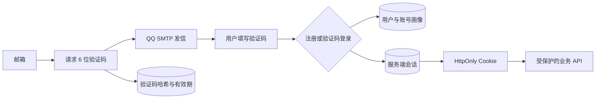

# 07 - 邮箱账号与服务器部署方案

> 状态：当前有效方案。
>
> 安全要求：SMTP 授权码、API Key、数据库密码和会话密钥不得写入本文、Git、聊天记录或前端代码。

## 1. 产品需求

Web MVP 使用拾音记自己的邮箱账号。用户、音乐画像、情境历史、反馈和网易云画像均通过内部 `user_id` 关联。

支持三条认证入口：

1. 邮箱验证码注册，并设置账号密码。
2. 邮箱与密码登录。
3. 邮箱验证码登录。

手机号注册与短信验证码不属于当前 Web MVP。

## 2. 认证链路



密码使用 PBKDF2-SHA256 和独立盐值存储。验证码只保存加盐哈希，10 分钟过期且最多尝试 5 次。会话令牌原值只保留在浏览器 Cookie，数据库保存令牌哈希。Cookie 使用 `HttpOnly`、`SameSite=Lax`，HTTPS 环境增加 `Secure`。

## 3. QQ 邮箱发送方案

- 本地开发：已使用 `EMAIL_PROVIDER=qq-smtp` 进行真实邮件联调，`AUTH_EXPOSE_DEV_CODE=false`。
- 故障排查：可临时切换 `EMAIL_PROVIDER=console` 并在非生产环境回显验证码。
- 正式服务器：`APP_ENV=production`、`EMAIL_PROVIDER=qq-smtp`，通过 QQ SMTP 发送邮件。
- 正式环境必须关闭验证码回显；邮件配置缺失时拒绝发送。
- QQ SMTP 使用独立授权码，不使用 QQ 登录密码。

连接参数：

| 项目 | 值 |
| --- | --- |
| SMTP 主机 | `smtp.qq.com` |
| SMTP 端口 | `465` |
| 连接安全 | SSL/TLS |
| 发件名称 | `拾音记` |
| 发件邮箱 | 已确认，作为服务器秘密配置 |
| SMTP 授权码 | 不记录在文档中，只配置到服务器秘密变量 |

QQ 邮箱适合 Demo 和小规模封闭测试。若后续触发发送限制、需要稳定投递统计或用户规模增长，应迁移到企业邮箱或专业事务邮件服务。

## 4. 账号数据归属

所有画像和行为数据继续使用 `user_id` 外键。API 从服务端会话解析当前用户，不接受前端传入的用户 ID，避免跨账号读取画像、历史或反馈。

网易云二维码会话按 `user_id` 隔离。扫码成功后，Cookie 使用 AES-GCM 和账号 `user_id` 作为附加认证数据加密，并写入 `music_connections`；服务重启后自动恢复，断开网易云时删除当前账号的持久凭据。Cookie 明文不会进入浏览器、模型、日志或数据库。

`MUSIC_CREDENTIAL_ENCRYPTION_KEY` 是 32 字节 Base64URL 密钥，必须稳定保存并随服务器秘密备份。更换或丢失密钥不会暴露 Cookie，但会导致已有授权无法解密，用户需要重新扫码。

## 5. 已知服务器信息

| 项目 | 当前信息 | 状态 |
| --- | --- | --- |
| 公网 IP | `39.97.48.186` | 已提供 |
| 操作系统 | Ubuntu 24.04 64 位 | 已提供 |
| 服务器配置 | 2 vCPU / 2 GiB RAM | 已提供，适合 Demo 与小规模测试 |
| 域名 | `shilrey.top` | 已提供 |
| HTTPS | 尚未配置 | 部署时使用 Caddy 自动申请和续期证书 |
| SMTP 465 出站 | 未确认 | 需要在服务器实测 |
| 数据库 | SQLite | 已确认，作为 Web MVP 内测数据库 |
| Web 访问域名 | `music.shilrey.top` | 已确认，待完成 DNS 解析 |
| 安全组 | `80/443` 入站已开放 | 已确认 |
| 测试收件邮箱 | 已提供 QQ 测试邮箱 | 已确认 |

## 6. 部署技术边界

当前应用基于 Vinext、Cloudflare Worker 和 D1。要部署到这台普通 Linux VPS，需要完成以下适配：

1. 将 D1 Repository 替换为单机 SQLite Repository，并增加迁移与备份机制。
2. 复用已实现的 QQ SMTP Provider，并在服务器环境验证 `smtp.qq.com:465` 出站连接。
3. 配置 Nginx 或 Caddy 反向代理、域名和 HTTPS。
4. 把本地网易云 API 作为服务器内部服务运行，并让 Web 通过内网地址访问。
5. 配置进程守护、日志轮转、数据库备份和服务重启策略。

数据库已确定为 SQLite：

- 当前 2 GiB 服务器只用于 Demo 和少量测试用户，SQLite 资源占用较低。
- 数据库文件放在持久化目录，禁止放入构建产物或临时目录。
- 部署时配置自动备份、恢复演练、文件权限和单实例写入约束。
- 后续公开邀请用户或需要多实例扩容时，再迁移到 PostgreSQL。
- 不能直接把 D1 本地文件当作 VPS 生产 SQLite 数据库，需要执行正式迁移。

## 7. 仍需用户确认的信息

开发服务器部署适配前，还需要确认：

1. 在域名服务商处为 `music.shilrey.top` 添加指向服务器公网 IP 的 A 记录，并确认解析生效。
2. 服务器是否允许访问 `smtp.qq.com:465`，部署时通过连接测试确认。
3. 再准备一个非 QQ 测试邮箱，用于检查跨服务商投递和垃圾箱情况。
4. 是否现在加入忘记密码与密码重置，建议正式上线前加入。
5. 账号注销策略：立即删除，还是设置短期冷静期。

不要通过聊天或文档提供服务器密码、SSH 私钥、SMTP 授权码或数据库密码。

## 8. 生产环境变量草案

```dotenv
APP_ENV=production
AUTH_EXPOSE_DEV_CODE=false
AUTH_SESSION_DAYS=14

EMAIL_PROVIDER=qq-smtp
QQ_SMTP_HOST=smtp.qq.com
QQ_SMTP_PORT=465
QQ_SMTP_SECURE=true
QQ_SMTP_USER=
QQ_SMTP_AUTH_CODE=
EMAIL_FROM_NAME=拾音记

SQLITE_DATABASE_PATH=/var/lib/shiyinji/shiyinji.db
NCM_API_BASE_URL=http://127.0.0.1:4000
```

所有空值只在服务器秘密环境中填写。日志只能记录脱敏收件地址、发送结果和错误类型，不得记录授权码或验证码正文。

## 9. 上线前必做

1. 撤销所有曾出现在聊天或文档中的 SMTP 授权码，重新生成并只放服务器环境变量。
2. 增加忘记密码与密码重置流程。
3. 增加 IP 与邮箱双维度验证码限流。
4. 将 `MUSIC_CREDENTIAL_ENCRYPTION_KEY` 配置到生产秘密环境并纳入备份。
5. 配置域名、HTTPS、生产数据库与备份。
6. 增加会话管理、全部设备退出和账号注销能力。
7. 验证 QQ SMTP 投递率、垃圾箱情况、错误重试和发送限制。
