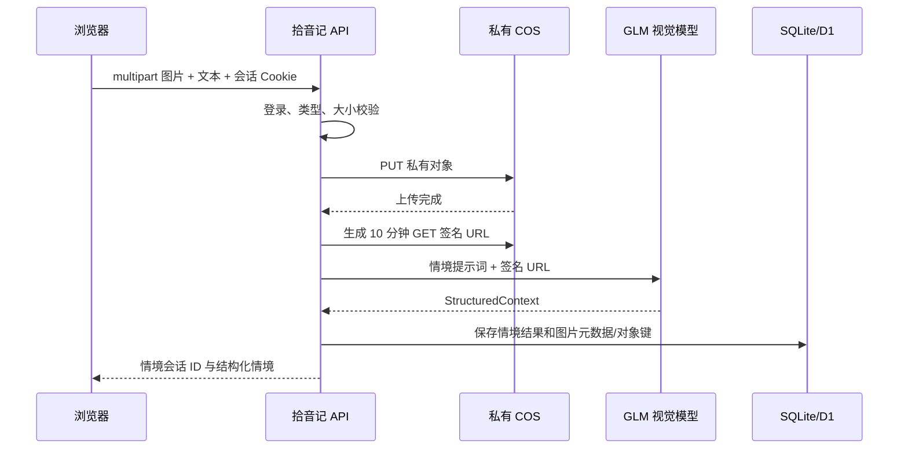

# 08. 情境图片存储方案

> 状态：Web MVP 已实现基础链路，待部署 COS 环境变量后启用。

## 1. 目标与边界

图片用于 GLM-4.6V-Flash 的情境理解，同时为后续用户回看、删除和硬件摄像头输入保留存储基础。图片不参与公开展示，不将永久密钥下发给浏览器，不把 Base64 图片写入数据库或发送给推荐规划模型。

当前接受 JPEG、PNG、WebP，默认最大 25MB。浏览器保留本地预览，原文件经拾音记服务端上传到 COS；该 MVP 方案优先保护密钥和缩短实施路径，后续大规模上传再切换到临时 STS 直传。

## 2. 已确定的对象存储约定

| 项目 | 当前值 |
| --- | --- |
| 服务 | Tencent COS 私有桶 |
| 地域 | `ap-nanjing` |
| 桶 | `boram-1333526493` |
| 对象键 | `context-images/{appUserId}/{YYYY-MM-DD}/{uuid}.{ext}` |
| 模型读取 | HTTPS GET 短时签名 URL，默认 600 秒 |
| 数据库 | 仅保存文件名、类型、大小、对象键、上传时间 |

`appUserId` 是拾音记账号内部 ID，不使用邮箱或网易云 ID。对象键不包含用户文件名，避免路径注入和敏感信息泄露。

## 3. 请求链路



上传失败不调用模型，返回可重试错误。模型签名 URL 过期或模型不可用时，不将图片降级为“已理解”；图片单独输入应明确报错，图文输入可按既有文本兜底策略处理。

## 4. 环境变量与权限

以下变量只存在于 `.dev.vars` 和服务器 `/etc/shiyinji/web.env`，不得提交或输出：

```dotenv
COS_SECRET_ID=
COS_SECRET_KEY=
COS_REGION=ap-nanjing
COS_BUCKET=boram-1333526493
COS_SIGNED_URL_TTL_SECONDS=600
COS_IMAGE_MAX_BYTES=26214400
```

COS 子账号应仅授予该桶 `context-images/*` 前缀的对象读写权限。桶维持私有；不要设置公共读或跨账号列表权限。

## 5. 待产品确认

- 原图默认保留多久，以及是否按账户设置留存开关。
- 历史记录中的图片预览是否需要重新签名接口。
- 用户删除单张图片、删除情境历史、注销账户时的 COS 删除任务。
- 是否启用 COS 生命周期规则作为兜底清理。

在这些决定落地前，前端只声明“仅用于本次情境理解”，不承诺立即删除或永久保存。
