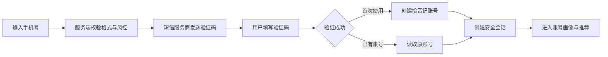

# 08 - 手机号验证码账号系统需求与技术方案

> 状态：已暂缓，不进入当前开发计划。
>
> 决策记录：由于当前没有短信套餐和短信签名主体资源，拾音记继续使用邮箱账号体系，正式验证码由 QQ 邮箱发送。本文件仅保留为未来启用手机号登录时的参考。

## 0. 当前有效决策

- 当前账号标识：邮箱。
- 当前注册：邮箱验证码验证后设置密码。
- 当前登录：邮箱密码登录，或邮箱验证码登录。
- 正式发件渠道：QQ 邮箱 SMTP。
- 手机号注册/登录：暂缓，不纳入 Web MVP。
- 当前正式方案见 `07-account-and-deployment.md`。

## 1. 先明确两个概念

QQ 邮箱只能通过 SMTP 发送**邮件验证码**，不能向手机发送**短信验证码**。

本方案按以下目标设计：

- 用户账号：手机号。
- 用户验证：手机短信验证码。
- 注册与登录：合并为同一条验证码链路；手机号首次验证成功时自动创建账号，再次验证时直接登录。
- QQ 邮箱：不参与用户登录，只用于管理员告警、客服收件或系统异常通知。

如果实际需求仍是“用户在手机上接收 QQ 邮件验证码”，本方案不适用，应继续使用邮箱账号方案。开发前必须最终确认这一点。

## 2. 产品需求

### 2.1 核心目标

用户无需设置密码，只使用手机号和短信验证码进入拾音记。用户画像、推荐历史、播放反馈、网易云音乐连接均绑定拾音记内部 `user_id`，手机号只是登录凭证，业务数据不能直接以手机号作为外键。

### 2.2 登录流程



### 2.3 页面与交互

登录页包含：

1. 国家或地区代码，Web MVP 首期只开放中国大陆 `+86`。
2. 手机号输入框。
3. “发送验证码”按钮，发送后进入 60 秒倒计时。
4. 6 位数字验证码输入框。
5. “登录 / 注册”主按钮。
6. 用户协议和隐私政策确认项；未确认时不得发送验证码。
7. 发送失败、频率受限、验证码错误、验证码过期等明确状态。

不再显示邮箱、密码、昵称注册字段。首次登录后可在账号设置中填写昵称。

### 2.4 账号规则

- 同一标准化手机号只能对应一个拾音记账号。
- 手机号在页面和日志中必须脱敏，例如 `138****1234`。
- 更换手机号需要同时验证旧手机号和新手机号，首期可暂不开放。
- 注销账号后进入冷静期或立即删除的规则，需要在正式上线前结合隐私政策确认。
- 手机号不可由前端直接修改 `user_id`，所有画像归属由服务端会话判断。

## 3. 验收标准

### 3.1 正常链路

- 新手机号收到验证码并验证成功后，自动创建账号和初始画像。
- 已有手机号验证成功后，读取该账号原有画像、历史与音乐连接状态。
- 登录后刷新页面仍保持会话，退出后受保护 API 返回 `401`。
- A 用户无法访问 B 用户的画像、历史、反馈或音乐连接。

### 3.2 异常链路

- 非法手机号不调用短信服务。
- 验证码过期、错误、已使用或超过尝试次数时不能登录。
- 重复点击、并发请求和接口重放不会重复发送或创建多个账号。
- 短信服务商超时或失败时不创建可用验证码，并返回可重试提示。
- 达到手机号、IP 或设备频率限制时拒绝发送。

## 4. 推荐技术方案

### 4.1 短信服务商

Web MVP 推荐腾讯云短信，原因是国内短信、Node.js SDK、验证码模板和回执能力完整。接入前需要完成实名资质、短信签名和正文模板审核，并购买短信套餐。

腾讯云当前要求国内短信先完成实名资质报备，再申请签名和模板；国内签名的运营商报备可能明显长于平台初审，因此这项工作应当先于代码开发启动：

- [腾讯云短信使用须知](https://cloud.tencent.com/document/product/382/13444)
- [腾讯云短信实名资质审核标准](https://cloud.tencent.com/document/product/382/108274)
- [腾讯云短信 Node.js SDK](https://cloud.tencent.com/document/product/382/43197)

短信发送必须封装为 `SmsProvider`，业务服务不能直接依赖腾讯云 SDK：

```ts
interface SmsProvider {
  sendVerificationCode(input: {
    phoneE164: string;
    code: string;
    expiresInMinutes: number;
  }): Promise<{ providerMessageId: string }>;
}
```

至少保留两个实现：

- `MockSmsProvider`：本地开发回显验证码，不产生短信费用。
- `TencentCloudSmsProvider`：测试及生产环境真实发送。

这样后续可以替换为阿里云短信等服务，而不改变登录 API 和用户数据。

### 4.2 API 设计

| API | 职责 |
| --- | --- |
| `POST /api/v1/auth/phone/code` | 校验手机号、执行限流并发送验证码 |
| `POST /api/v1/auth/phone/verify` | 校验验证码，创建或读取账号并建立会话 |
| `GET /api/v1/auth/session` | 查询当前登录账号 |
| `POST /api/v1/auth/logout` | 撤销当前会话 |
| `POST /api/v1/auth/phone/change` | 更换手机号，后续版本实现 |

发送验证码请求：

```json
{
  "country_code": "+86",
  "phone": "13800138000"
}
```

验证请求：

```json
{
  "country_code": "+86",
  "phone": "13800138000",
  "code": "123456"
}
```

接口响应不得返回真实生产验证码、短信服务 SecretKey 或完整手机号。

### 4.3 数据模型调整

现有 `users.email NOT NULL` 和邮箱认证表需要迁移，不能直接删表覆盖：

- `users.phone_e164`：标准化手机号，唯一索引，正式账号必填。
- `users.email`：改为可空，仅作为可选联系信息；手机号版本不再依赖该字段。
- `phone_verification_codes`：手机号、用途、验证码哈希、盐、过期时间、尝试次数、消费时间、发送状态和服务商消息 ID。
- `auth_sessions`：继续沿用当前会话表，不需要重做画像归属。
- `auth_credentials`：密码登录停止使用；迁移观察期后再决定是否删除。

已创建的邮箱测试账号保留为开发数据，不自动映射到手机号。正式环境如果已有真实邮箱用户，需要设计“邮箱验证后绑定手机号”的迁移流程，禁止仅凭邮箱文本合并账号。

### 4.4 安全与风控

- 手机号统一转换为 E.164 格式，例如 `+8613800138000`。
- 验证码只保存加盐哈希，不保存明文；建议 5 分钟过期、最多尝试 5 次、验证成功后立即失效。
- 同一手机号发送间隔至少 60 秒，并限制小时/日发送次数。
- 同时按手机号、IP、设备标识三个维度限流，异常频率触发图形验证码。
- 验证码请求返回统一提示，避免批量探测手机号是否注册。
- 会话继续使用随机令牌、服务端令牌哈希和 `HttpOnly + SameSite=Lax + Secure` Cookie。
- 腾讯云 `SecretKey`、QQ 邮箱授权码和会话密钥只放服务器秘密变量，不进入 Git、日志或前端。
- 保留发送结果、失败码和脱敏手机号用于审计，但不记录验证码正文。

单机 Demo 可用数据库限流；多实例或公开测试建议增加 Redis，用于跨实例原子计数、验证码状态和临时封禁。

## 5. QQ 邮箱在本项目中的用途

QQ 邮箱不承担手机验证码发送。可选用途：

- 短信服务连续失败时通知管理员。
- 服务器异常、额度不足或账号风控告警。
- 接收用户反馈和客服邮件。

部署到普通 Node.js VPS 后，可使用 SMTP 发送这些内部邮件。需要：

1. 一个专用 QQ 邮箱，不使用个人主邮箱更稳妥。
2. 在 QQ 邮箱设置中开启 SMTP 服务。
3. 生成独立授权码，代码中使用授权码，绝不使用 QQ 密码。
4. SMTP 地址 `smtp.qq.com`，优先使用 SSL 端口 `465`。
5. 环境变量保存邮箱地址、授权码、SMTP 地址和端口。

当前应用仍包含 Cloudflare Worker 运行方式，传统 Node SMTP 库不应作为 Worker 部署的默认方案；待切换到 VPS 后再接 QQ SMTP。QQ 邮箱更适合内部测试和低频告警，不建议承担大规模用户验证码邮件。

## 6. 需要用户准备的信息与资源

### 6.1 开发前必须确认

| 项目 | 需要的信息 |
| --- | --- |
| 登录目标 | 确认是“手机号短信验证码”，不是“手机接收邮件验证码” |
| 服务商 | 腾讯云短信或其他指定服务商 |
| 使用地区 | 首期是否只支持中国大陆 `+86` |
| 账号策略 | 验证成功即自动注册，还是先进入单独注册确认页 |
| 旧账号 | 当前邮箱测试账号是否全部作为开发数据处理 |
| 部署环境 | Cloudflare、普通 Linux VPS，或二者分离 |

### 6.2 腾讯云短信资源

- 腾讯云账号及实名认证状态。
- 可用于国内短信签名报备的中国大陆公司主体资料；当前规则下个人主体申请国内自用签名受限。
- 营业执照、盖章材料、管理员/经办人信息，以及服务商要求的其他实名资料。
- 审核通过的短信签名，建议使用可证明归属的公司名称或简称；“拾音记”若无商标或主体归属证明，可能无法直接作为签名。
- 审核通过的验证码正文模板，例如“`{1}` 为登录验证码，`{2}` 分钟内有效”。
- `SDKAppID`、签名名称、模板 ID。
- 仅具有短信发送权限的腾讯云子账号 `SecretID` 与 `SecretKey`。
- 国内短信套餐和费用预算、余额告警联系人。
- 发送回执或状态回调需求。

### 6.3 QQ 邮箱资源

- 专用 QQ 邮箱地址。
- 已开启 SMTP 服务。
- QQ 邮箱 SMTP 授权码，不提供 QQ 登录密码。
- 系统告警收件人邮箱列表。

### 6.4 产品与合规资源

- 用户协议与隐私政策，明确手机号用途、保存期限、第三方短信服务商和注销方式。
- 网站域名及 HTTPS 证书。
- 测试手机号清单，至少覆盖正常、重复发送、错误验证码和频率受限场景。
- 客服或问题反馈渠道。
- 日志和监控方案，至少包含短信发送成功率、验证成功率、成本和异常频率。

### 6.5 服务器资源

- 目标服务器操作系统、Node.js 版本和公网域名。
- PostgreSQL 或单机 SQLite 的最终选择；公开测试更推荐 PostgreSQL。
- Redis 是否可用；公开注册建议配置。
- 服务端秘密变量管理方式和数据库备份策略。
- Web 服务访问腾讯云短信 API 的出网能力。

## 7. 环境变量草案

```dotenv
AUTH_CHANNEL=phone
AUTH_SESSION_DAYS=14
AUTH_EXPOSE_DEV_CODE=false

SMS_PROVIDER=tencent-cloud
SMS_COUNTRY_CODE=+86
TENCENT_SMS_SECRET_ID=
TENCENT_SMS_SECRET_KEY=
TENCENT_SMS_SDK_APP_ID=
TENCENT_SMS_SIGN_NAME=
TENCENT_SMS_TEMPLATE_ID=

# 仅用于 VPS 上的内部告警邮件
ALERT_EMAIL_PROVIDER=qq-smtp
QQ_SMTP_HOST=smtp.qq.com
QQ_SMTP_PORT=465
QQ_SMTP_USER=
QQ_SMTP_AUTH_CODE=
ALERT_EMAIL_TO=
```

本地开发使用 `SMS_PROVIDER=mock` 和 `AUTH_EXPOSE_DEV_CODE=true`。生产环境若检测到验证码回显开启，服务必须拒绝启动或拒绝发送。

## 8. 实施顺序

1. 用户确认手机号短信方案、服务商、地区和旧账号处理规则。
2. 立即提交腾讯云实名资质、短信签名和模板审核；该步骤可能成为进度关键路径。
3. 调整数据库 Schema 和迁移，保留现有账号画像外键。
4. 实现 `SmsProvider`、验证码风控和手机号认证 API。
5. 把登录页改为手机号验证码单入口。
6. 完成注册、登录、退出、越权、限流和服务商失败测试。
7. 在测试环境接腾讯云真实短信，小规模验证送达率和费用。
8. 确定 VPS 后再接 QQ SMTP 告警、生产数据库、HTTPS 和监控。

## 9. 未来恢复手机号方案时的阻塞项

进入真实短信开发前，至少需要用户提供或确认：

1. “手机号短信验证码”这一目标无歧义。
2. 短信服务商选择。
3. 是否具备可用于国内短信签名报备的公司主体及材料。
4. 计划使用的短信签名名称和归属证明。
5. 首期是否只允许 `+86` 手机号。

在资质和模板审核完成前，可以先完成 Mock 短信、本地手机号账号和全部业务迁移，但无法验证真实短信送达。
