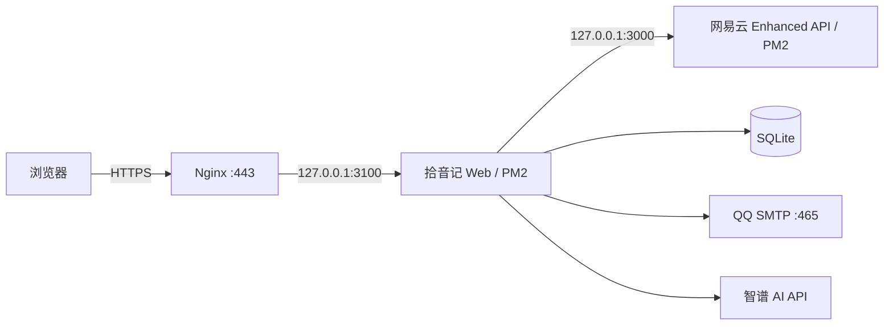

# 09 - VPS 部署与运维手册

> 状态：Web MVP 已部署。本文不记录任何 API Key、SMTP 授权码、音乐平台凭据或 SSH 私钥。

## 1. 当前拓扑



- 访问地址：`https://music.shilrey.top`
- Web 发布目录：`/opt/shiyinji/releases/<git-short-sha>`
- 当前版本软链接：`/opt/shiyinji/current`
- 生产环境变量：`/etc/shiyinji/web.env`，权限 `600`
- SQLite：`/var/lib/shiyinji/shiyinji.db`
- Web 进程：PM2 `shiyinji-web`，监听 `127.0.0.1:3100`
- 网易云进程：PM2 `api`，监听 `127.0.0.1:3000`
- Nginx 生效配置：`/usr/local/nginx/nginx.conf`

## 2. 发布新版本

本地先完成验证并推送 GitHub：

```powershell
npm run typecheck
npm run lint
npm test
$env:VPS_BUILD = "true"
npm run build
git push
```

用 `git archive` 生成不包含 `.env`、`.git` 和本地工作文件的发布包。服务器上解压到新的 release 目录，使用 Node 22 安装依赖，并在构建时设置 `VPS_BUILD=true`。构建成功后才切换软链接：

```bash
release=/opt/shiyinji/releases/<git-short-sha>
mkdir -p "$release"
tar -xzf /tmp/shiyinji-vps-<git-short-sha>.tar.gz -C "$release"
cd "$release"
PATH=/opt/node-v22/bin:$PATH npm ci --no-audit --no-fund
VPS_BUILD=true NODE_OPTIONS=--max-old-space-size=1536 PATH=/opt/node-v22/bin:$PATH npm run build
ln -sfn "$release" /opt/shiyinji/current
pm2 restart shiyinji-web
pm2 save
```

不要把服务器环境文件打进发布包。Windows 环境文件上传后必须清除行尾 CR：

```bash
sed -i 's/\r$//' /etc/shiyinji/web.env
```

## 3. 验收与排障

```bash
pm2 ls
pm2 logs shiyinji-web --lines 100 --nostream
curl -I http://127.0.0.1:3100/
curl -I https://music.shilrey.top/
curl 'http://127.0.0.1:3000/search?keywords=test&limit=1'
sqlite3 /var/lib/shiyinji/shiyinji.db '.tables'
```

预期结果：主页为 `200`；未登录访问 `/api/v1/auth/session` 为 `401`；网易云搜索为 `200`。验证码请求成功时只返回 `accepted=true`，生产环境不得返回验证码正文。

## 4. 回滚

发布失败时不切换 `current`。运行期发现问题时，将软链接指回上一版并重启 Web：

```bash
ln -sfn /opt/shiyinji/releases/<previous-sha> /opt/shiyinji/current
pm2 restart shiyinji-web
pm2 save
```

回滚应用前先确认新版本是否写入了不兼容的数据结构。当前 Schema 使用幂等建表，尚未建立破坏性迁移流程。

## 5. 备份与证书

- `/etc/cron.d/shiyinji-backup` 每天调用 `/opt/shiyinji/backup-db.sh`。
- 备份目录为 `/var/backups/shiyinji`，权限 `600`，保留 14 天。
- Certbot 自动续期已启用。
- `/etc/letsencrypt/renewal-hooks/deploy/reload-nginx-shiyinji` 在续期后验证配置并热重载 Nginx。

手工检查：

```bash
/opt/shiyinji/backup-db.sh
sqlite3 /var/backups/shiyinji/<backup-file>.db 'PRAGMA integrity_check;'
certbot renew --dry-run --cert-name music.shilrey.top --no-random-sleep-on-renew
/usr/sbin/nginx -t -c /usr/local/nginx/nginx.conf
```

## 6. 安全约束

- 临时部署公钥在验收完成后从 `/root/.ssh/authorized_keys` 移除。
- 已在聊天中出现过的 API Key、SMTP 授权码和音乐平台密码应在正式开放用户前轮换。
- 不开放 `3000` 和 `3100` 公网入站，仅保留 `80/443`。
- SQLite、备份和环境文件保持最小权限；日志不得输出验证码、Cookie 或凭据明文。
- 当前依赖审计仍有已知告警，升级前需逐项验证 Vinext、Cloudflare 和 Node 运行时兼容性，禁止直接执行强制修复。
