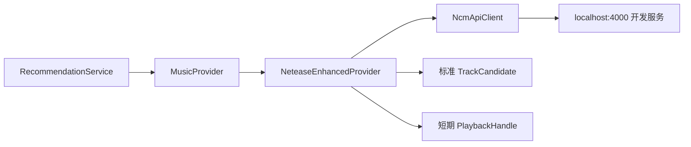
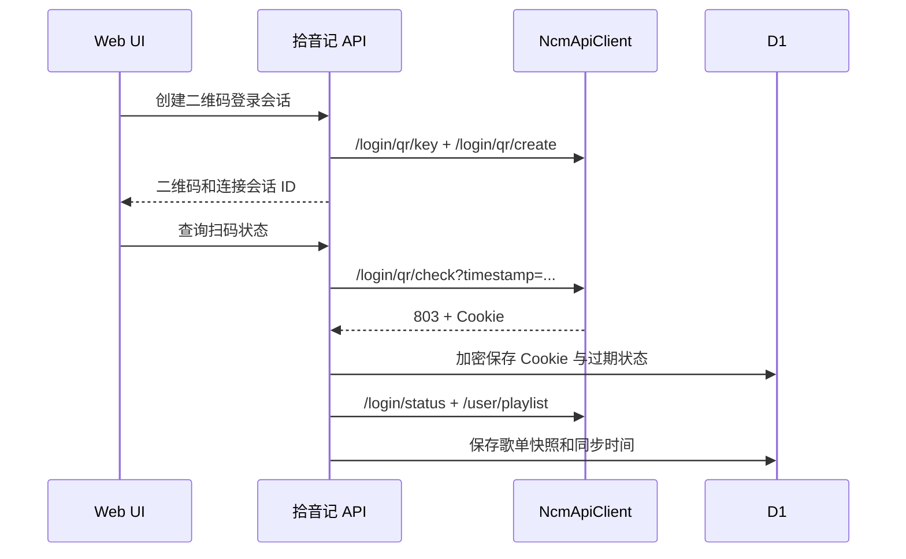
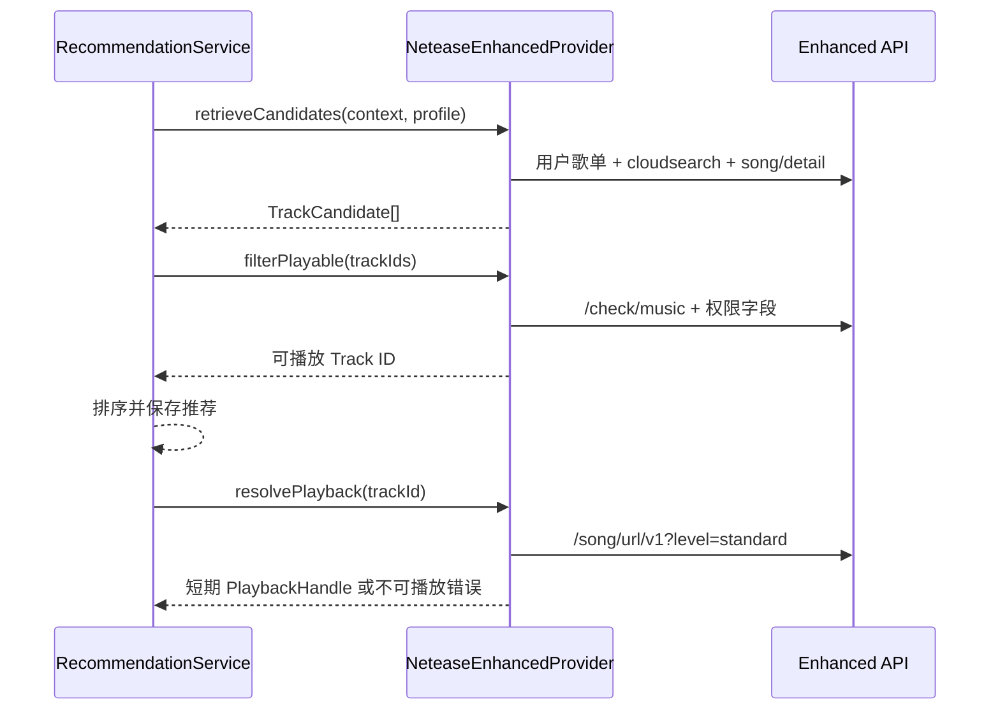

# 网易云 Enhanced API 对接研究

## 1. 当前结论

本地服务 `http://localhost:4000` 已验证可用，匿名调用 `/search?keywords=陈奕迅&limit=2&type=1` 成功返回真实歌曲 ID、歌名、歌手、专辑和时长。进一步用《海阔天空》串联搜索、歌曲详情、可用性检查和标准音质播放 URL，四个接口均返回成功；但返回结果同时标记 `fee=1` 和 `freeTrialInfo`，证明“拿到 URL”不等于“拿到完整歌曲播放权”，适配器必须识别试听状态。

该项目适合在非商业封闭测试中验证“账号歌单能否进入推荐候选”和“当前账号是否能获得播放 URL”，但它是通过模拟客户端请求网易接口工作的第三方项目，不等于获得音乐版权或商业播放授权。

开发阶段应把它放在 `MusicProvider` 后面，浏览器不直接访问 `localhost:4000`，也不直接持有网易 Cookie。生产环境不能访问用户电脑的 localhost，届时必须部署独立的受控适配服务，或更换正式授权音乐服务。

## 2. 需要使用的接口

| 业务职责 | Enhanced API | 登录要求 | 拾音记用途 |
| --- | --- | --- | --- |
| 登录状态 | `GET /login/status` | Cookie | 确认连接是否有效 |
| 二维码 key | `GET /login/qr/key?timestamp=...` | 否 | 开始二维码登录 |
| 二维码图片 | `GET /login/qr/create?key=...&qrimg=true&timestamp=...` | 否 | 展示二维码 |
| 扫码状态 | `GET /login/qr/check?key=...&timestamp=...` | 否 | 轮询 800/801/802/803 状态并取得 Cookie |
| 用户歌单 | `GET /user/playlist?uid=...` | 是 | 导入用户偏好入口 |
| 歌单曲目 | `GET /playlist/track/all?id=...&limit=...&offset=...` | 建议登录 | 分页取得完整歌单候选 |
| 搜索歌曲 | `GET /cloudsearch?keywords=...&type=1` | 否 | 情境召回和曲目补全 |
| 歌曲详情 | `GET /song/detail?ids=...` | 否 | 标准化标题、艺人、封面、时长和权限字段 |
| 可用性检查 | `GET /check/music?id=...` | 视曲目而定 | 推荐前硬过滤 |
| 播放 URL | `GET /song/url/v1?id=...&level=standard` | 完整播放通常需要登录/会员 | 播放前临时解析 URL |

不接入 `/song/url/match`、`unblock=true`、随机中国 IP、代理池或音源替换。这些能力会绕开正常的版权或区域限制，不属于拾音记的产品范围。

## 3. Provider 映射

`NcmApiClient` 只负责 HTTP、Cookie、超时和错误码；`NeteaseEnhancedProvider` 负责把网易字段映射为拾音记领域对象：

- `id` 映射为 `providerTrackId`，全局 ID 使用 `netease:{id}`。
- `name`、`ar[].name`、`al.picUrl`、`dt` 映射为标题、艺人、封面和时长。
- `privilege.st < 0`、`toast=true`、`check/music.success=false` 或播放 URL 为空时视为不可播放。
- `fee` 不能单独证明用户有完整播放权限，最终以当前账号解析出的 URL、试听标志和权限字段为准。
- 播放 URL 只封装为短期 `PlaybackHandle` 返回，不写入曲目表，也不参与推荐缓存。

## 4. 功能链路

### 账号连接与歌单导入

### 推荐与播放

## 5. Cookie 与缓存规则

- 网易 Cookie 只能在服务端保存，至少使用应用级密钥加密；日志、前端响应和分析事件都不得包含 Cookie。
- 登录接口不重复调用；二维码轮询必须带时间戳并设置退避，避免两分钟缓存和风控。
- 搜索与歌曲详情可以短期缓存；登录状态、播放 URL 和可播放性需要按用户隔离缓存。
- 播放 URL 到期后重新解析，不把 URL 当作稳定音源。
- 401/301 表示登录状态问题，403/460/503 不能通过伪造 IP 或代理绕过，应向用户降级为不可播放。

## 6. 后续实施拆分

1. 新增 `NcmApiClient`，先完成匿名搜索、歌曲详情和可用性检查的契约测试。
2. 实现 `NeteaseEnhancedProvider.retrieveCandidates`，先只用于开发环境候选召回。
3. 增加二维码连接 API、Cookie 加密和歌单分页同步。
4. 最后实现 `resolvePlayback`，用免费歌曲和有合法会员权限的测试账号做封闭验证。
5. 商业化前重新评估正式授权服务；第三方 Enhanced API 不作为商业版权方案。
