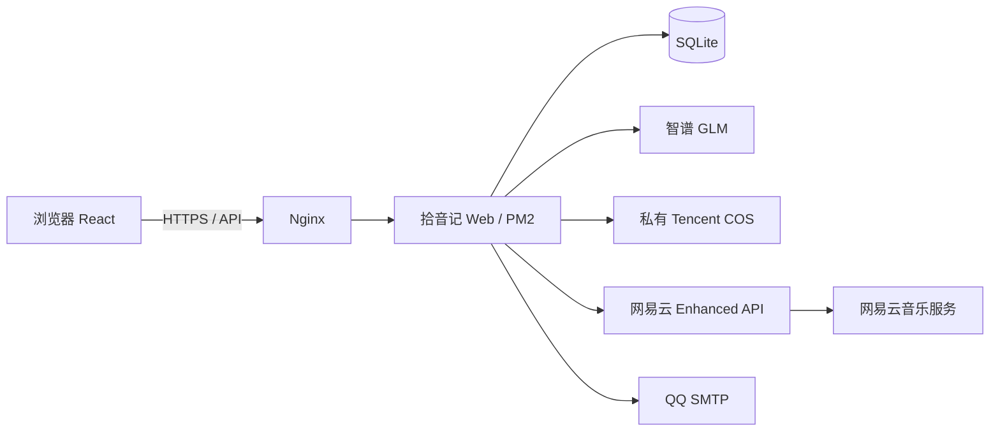
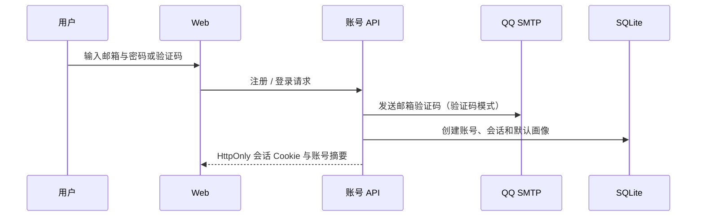
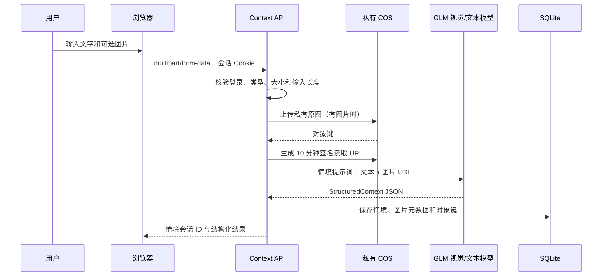
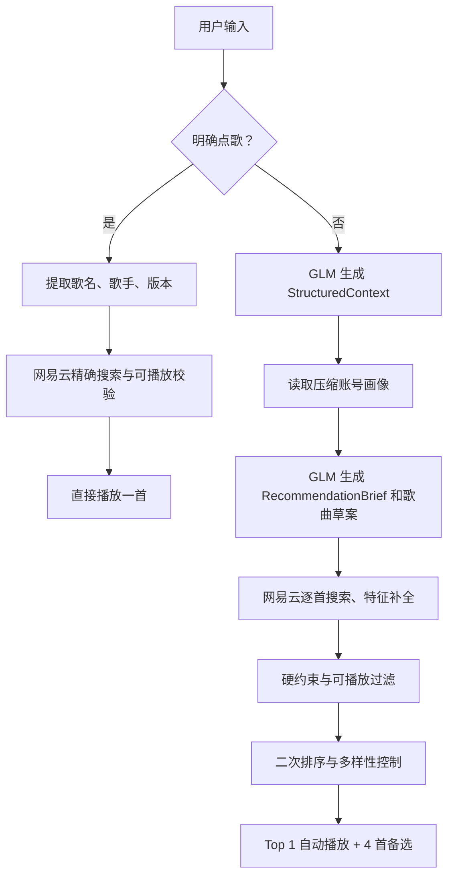
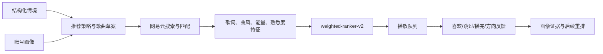

# 拾音记 Demo V1 项目说明书

> 最后更新：2026-08-17  
> 主分支：`main`  
> 线上地址：`https://music.shilrey.top`

## 1. 项目定位

拾音记是一个情境音乐推荐 Web MVP。用户可以输入一句话、一张图片或图文组合；系统理解当下的情绪、活动和环境，结合账号级音乐画像，推荐并播放一首最匹配的真实歌曲，同时展示备选歌曲。

当前 Web 产品用于验证“情境理解 + 用户画像是否能改善选歌”。长期目标是带摄像头、眼睛状态和语音交互的硬件音箱，但硬件协议与外观设计不在本版本范围。

## 2. 当前能力

| 领域 | 已完成能力 |
| --- | --- |
| 拾音记账号 | 邮箱验证码注册、密码登录、验证码登录、会话退出；数据按账号隔离 |
| 情境输入 | 支持文本、JPEG/PNG/WebP 图片、图文组合；图片上限 25MB |
| 图片理解 | 原图上传私有腾讯 COS，GLM 使用短时签名 URL 理解图片，不接收浏览器 Base64 |
| 语义理解 | 文本使用 `glm-4.7-flash`，图片/图文使用 `glm-4.6v-flash`，输出统一结构化情境 |
| 点歌 | 识别“播放某首歌”意图；指定歌手时严格匹配，未指定时允许任意歌手版本 |
| 推荐 | 结合情境、账号音乐画像、模型草案和网易云搜索结果，返回 Top 1 与备选 |
| 音乐画像 | 可连接网易云并同步喜欢、歌单、播放记录；用户可手工调整偏好 |
| 播放 | 解析可播放 URL、歌曲切换防竞态、进度控制、同步歌词与滚动高亮 |
| 反馈 | 记录喜欢、不喜欢、跳过、播完等行为，为后续画像增量更新保留数据 |
| 部署 | VPS 上运行 Web、SQLite、NCM Enhanced API、Nginx、HTTPS、PM2 和 QQ SMTP |

## 3. 总体架构



- 浏览器只与拾音记 API 通信，不直接携带模型密钥、COS 密钥、网易 Cookie 或 SMTP 信息。
- Web API 对部署目标保持 Cloudflare Worker 兼容；VPS 使用 SQLite 运行时适配器。
- 网易云 Cookie 仅服务端使用，并按照拾音记账号加密保存。

## 4. 核心流程

### 4.1 登录与账号画像



画像归属于拾音记账号，不归属于单一浏览器或网易云会话。用户连接网易云后，其歌单、喜欢和播放记录只作为画像证据，不会暴露给模型或前端原始数据。

### 4.2 文本、图片和图文情境理解



图片对象键格式为 `context-images/{appUserId}/{YYYY-MM-DD}/{uuid}.{ext}`。数据库不保存签名 URL；前端不承诺图片立即删除。图片生命周期、历史预览和用户删除能力仍待产品决策，详见 `docs/architecture/08-context-image-storage.md`。

### 4.3 点歌与情境推荐分流



明确点歌不会进入情境推荐。用户未指定歌手时，系统按歌曲标题寻找可播放版本；指定歌手时会拒绝错歌手、翻唱或低置信结果。

### 4.4 推荐和反馈闭环



推荐算法当前已跑通但仍是 MVP：模型草案的质量、平台搜索命中率、歌曲特征的完备性和反馈后的真实增量学习，都需要在后续专项优化中验证。

## 5. 主要 API

| API | 责任 |
| --- | --- |
| `POST /api/v1/auth/email-code` | 发送注册或登录验证码 |
| `POST /api/v1/auth/register` | 注册账号并初始化画像 |
| `POST /api/v1/auth/login/password` | 邮箱密码登录 |
| `POST /api/v1/auth/login/code` | 邮箱验证码登录 |
| `GET /api/v1/auth/session` | 返回当前会话账号 |
| `POST /api/v1/context-sessions` | 保存输入并生成情境；图片上传 COS 后交给视觉模型 |
| `POST /api/v1/recommendations` | 根据情境会话生成推荐队列 |
| `POST /api/v1/playback/resolve` | 获取当前账号可播放的音频 URL |
| `GET/PATCH /api/v1/profile` | 读取或修改账号音乐画像 |
| `POST/PATCH/DELETE /api/v1/music-connections/netease` | 创建、轮询或断开网易云二维码连接 |
| `POST /api/v1/profile/music/sync` | 同步网易云曲库证据并刷新画像 |
| `GET /api/v1/tracks/:trackId/lyrics` | 获取歌词时间轴与翻译行 |
| `POST /api/v1/events/playback` | 记录播放、暂停、跳过、播完等事件 |
| `POST /api/v1/feedback` | 保存喜欢、不喜欢和方向反馈 |

完整契约以 `docs/architecture/03-api-contracts.md` 为设计参考；实际可调用路由以 `app/api/v1` 目录为准。

## 6. 代码地图

| 位置 | 说明 |
| --- | --- |
| `app/music-app.tsx` | 主音乐界面、播放控制、图片预览、登录后的交互 |
| `app/api/v1` | Web API 路由与账号边界 |
| `src/domain` | 情境、歌曲、画像、反馈、推荐等领域类型 |
| `src/providers/ai/real.ts` | GLM/OpenAI 兼容模型调用、视觉输入和安全守卫 |
| `src/providers/music/netease.ts` | 网易云搜索、特征补全、匹配和可播放校验 |
| `src/services/recommendation.ts` | 推荐过滤、重排和多样性控制 |
| `src/services/context-image-storage.ts` | COS 原图上传与短时签名 URL |
| `src/repositories` | 数据库访问抽象 |
| `db` | Drizzle Schema、SQLite/D1 初始化 |
| `docs/architecture` | 架构、流程、部署、探索策略文档 |

## 7. 本地运行与验证

前置条件：Node.js `>=22.13.0`，并启动本地 NCM Enhanced API（默认 `http://localhost:4000`）。

```powershell
cd D:\Desk\拾音记\demo-v1
npm install
npm run dev -- --port 3101
```

环境文件使用 `.dev.vars`，可从 `.dev.vars.example` 复制。以下信息只能保存于本地或服务器环境文件：模型密钥、COS 密钥、SMTP 授权码、网易云凭据、加密密钥。禁止提交、粘贴到日志或写入文档。

```powershell
npm run typecheck
npm run lint
npm test
npm run eval:context:rescore
```

## 8. 生产部署说明

线上部署使用：Nginx `443` -> PM2 Web `127.0.0.1:3100` -> NCM API `127.0.0.1:3000`。SQLite 数据位于服务器专用目录，COS、模型、SMTP 等变量位于 `/etc/shiyinji/web.env`，权限为 `600`。

发布使用不可变 release 目录：`/opt/shiyinji/releases/<git-sha>`，构建成功后切换 `/opt/shiyinji/current` 软链接，再重启 `shiyinji-web`。详细步骤、回滚、备份和证书检查见 `docs/architecture/09-vps-deployment-runbook.md`。

## 9. 已知限制与下一阶段

1. 推荐质量仍需专项评估。优先建立真实测试集，记录情境、画像摘要、模型草案、搜索匹配、最终 Top 5 与人工评分。
2. 免费 GLM 可能短时限流；当前有重试与文本规则兜底，但图片单独输入不能伪装成“已理解”。
3. 网易云 Enhanced API 仅适用于当前封闭开发验证；公开商用前必须接入具备完整授权的音乐服务。
4. 图片已实现私有 COS 存储，但留存期限、历史预览、用户删除和账户注销时的清理任务尚未实现。
5. 账号系统下一步应补充忘记密码、密码重置、全部设备退出、注销、验证码限流和登录审计。
6. 硬件阶段再设计语音输入、唤醒词、摄像头物理遮挡、隐私提示和“眼睛”状态机。

## 10. 关联文档

- `QUICKSTART.md`：新开发会话快速接手说明。
- `docs/architecture/01-system-architecture.md`：系统分层与职责。
- `docs/architecture/03-api-contracts.md`：API 设计契约。
- `docs/architecture/04-feature-flows.md`：产品功能时序。
- `docs/architecture/06-discovery-and-exploration.md`：发现与探索策略。
- `docs/architecture/08-context-image-storage.md`：COS 图片存储方案。
- `docs/architecture/09-vps-deployment-runbook.md`：VPS 发布和运维。
